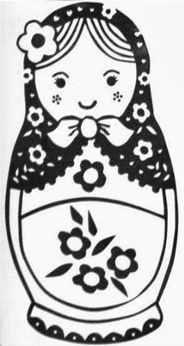

# Matryoshka Doll
Author: dch0017

## Description
Matryoshka dolls are a set of wooden dolls of decreasing size placed one inside another. What's the final one?

## Getting Started
We get a jpg of this doll:</br>

</br>


## Dig Deeper
First thing's first, let's grab the file and put it in our folder.

My standard checks for pictures are going to be ```strings```, ```binwalk```, and ```hexedit```.

```strings``` will find any text strings embedded in files. </br>
```binwalk``` searches a image file for embedded files or executable code.</br>
```hexedit``` is a file editor that shows you hex along with ASCII equivalent.</br>

```console
┌──(dch0017㉿linux)-[~/Forensics/MatryoshkaDoll]
└─$ strings dolls.jpg | grep -o "pico{.*}"
```

```Strings``` doesn't give us any info but ```binwalk``` does reveal something:
```console
┌──(dch0017㉿linux)-[~/Forensics/MatryoshkaDoll]
└─$ binwalk dolls.jpg

DECIMAL       HEXADECIMAL     DESCRIPTION
--------------------------------------------------------------------------------
0             0x0             PNG image, 594 x 1104, 8-bit/color RGBA, non-interlaced
3226          0xC9A           TIFF image data, big-endian, offset of first image directory: 8
272492        0x4286C         Zip archive data, at least v2.0 to extract, compressed size: 378956, uncompressed size: 383938, name: base_images/2_c.jpg
651614        0x9F15E         End of Zip archive, footer length: 22
```

## Zipped Up
Interesting, we see there is a zip archive inside the PNG file. Let's go ahead and unzip that using ```unzip```.

```console
┌──(dch0017㉿linux)-[~/Forensics/MatryoshkaDoll]
└─$ unzip dolls.jpg
Archive:  dolls.jpg
warning [dolls.jpg]:  272492 extra bytes at beginning or within zipfile
  (attempting to process anyway)
  inflating: base_images/2_c.jpg

┌──(dch0017㉿linux)-[~/Forensics/MatryoshkaDoll]
└─$ file base_images
base_images: directory

┌──(dch0017㉿linux)-[~/Forensics/MatryoshkaDoll]
└─$ ls base_images
2_c.jpg
```

Here we can see that unzipping it, brought out the ```base_images``` directory with the ```2_c.jpg``` file within it.

## Layers and Layers
Due to the title of this challenge I want to go ahead and immediately ```binwalk``` this new file, so lets do that.

### Binwalk 2_c.jpg
```console
┌──(dch0017㉿linux)-[~/Forensics/MatryoshkaDoll/base_images]
└─$ binwalk 2_c.jpg

DECIMAL       HEXADECIMAL     DESCRIPTION
--------------------------------------------------------------------------------
0             0x0             PNG image, 526 x 1106, 8-bit/color RGBA, non-interlaced
3226          0xC9A           TIFF image data, big-endian, offset of first image directory: 8
187707        0x2DD3B         Zip archive data, at least v2.0 to extract, compressed size: 196043, uncompressed size: 201445, name: base_images/3_c.jpg
383805        0x5DB3D         End of Zip archive, footer length: 22
383916        0x5DBAC         End of Zip archive, footer length: 22

```

What do you know, another zip. Let's go ahead and unzip:

### Unzipping 2_c.jpg
```console
┌──(dch0017㉿DESKTOP-PCNHS4C)-[~/Forensics/MatryoshkaDoll/base_images]
└─$ unzip 2_c.jpg
Archive:  2_c.jpg
warning [2_c.jpg]:  187707 extra bytes at beginning or within zipfile
  (attempting to process anyway)
  inflating: base_images/3_c.jpg
```

A new file appeared: ```3_c.jpg```. Again I want to ```binwalk``` it, but first I'll double check it is an image with ```file```.

### Binwalk 3_c.jpg
```console
┌──(dch0017㉿linux)-[~/Forensics/MatryoshkaDoll/base_images/base_images]
└─$ file 3_c.jpg
3_c.jpg: PNG image data, 428 x 1104, 8-bit/color RGBA, non-interlaced

┌──(dch0017㉿linux)-[~/Forensics/MatryoshkaDoll/base_images/base_images]
└─$ binwalk 3_c.jpg

DECIMAL       HEXADECIMAL     DESCRIPTION
--------------------------------------------------------------------------------
0             0x0             PNG image, 428 x 1104, 8-bit/color RGBA, non-interlaced
3226          0xC9A           TIFF image data, big-endian, offset of first image directory: 8
123606        0x1E2D6         Zip archive data, at least v2.0 to extract, compressed size: 77651, uncompressed size: 79808, name: base_images/4_c.jpg
201423        0x312CF         End of Zip archive, footer length: 22
```

### Unzipping 3_c.jpg
```console
┌──(dch0017㉿linux)-[~/Forensics/MatryoshkaDoll/base_images/base_images]
└─$ unzip 3_c.jpg
Archive:  3_c.jpg
warning [3_c.jpg]:  123606 extra bytes at beginning or within zipfile
  (attempting to process anyway)
  inflating: base_images/4_c.jpg
```

### Binwalk 4_c.jpg
```console
┌──(dch0017㉿linux)-[~/Forensics/MatryoshkaDoll/base_images/base_images/base_images]
└─$ binwalk 4_c.jpg

DECIMAL       HEXADECIMAL     DESCRIPTION
--------------------------------------------------------------------------------
0             0x0             PNG image, 320 x 768, 8-bit/color RGBA, non-interlaced
3226          0xC9A           TIFF image data, big-endian, offset of first image directory: 8
79578         0x136DA         Zip archive data, at least v2.0 to extract, compressed size: 64, uncompressed size: 81, name: flag.txt
79786         0x137AA         End of Zip archive, footer length: 22
```

This is a little different, we see inside the zip file there is a ```flag.txt```. Hopefully near the end!

### Unzipping 4_c.jpg
```console
┌──(dch0017㉿linux)-[~/Forensics/MatryoshkaDoll/base_images/base_images/base_images]
└─$ unzip 4_c.jpg
Archive:  4_c.jpg
warning [4_c.jpg]:  79578 extra bytes at beginning or within zipfile
  (attempting to process anyway)
  inflating: flag.txt
```

### Read the Flag
Let's ```cat``` out this txt file and there we go:
```console
┌──(dch0017㉿linux)-[~/Forensics/MatryoshkaDoll/base_images/base_images/base_images]
└─$ cat flag.txt
picoCTF{336cf6d51c9d9774fd37196c1d7320ff}
```
