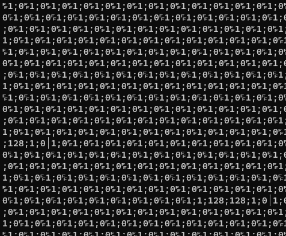
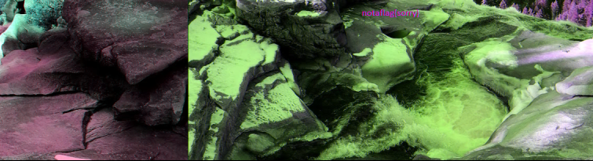
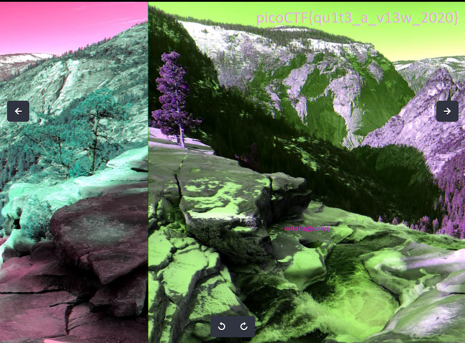

# tunn3l v1s10n
Author: dch0017

## Description
We found this file. Recover the flag.

## Getting Started
Let's grab the file and see what ```file``` gives us.

```console
┌──(dch0017㉿linux)-[~/Forensics/tunn3lv1s10n]
└─$ wget https://mercury.picoctf.net/static/d0129ad98ba9258ab59e7700a1b18c14/tunn3l_v1s10n -O tunnelvision -q

┌──(dch0017㉿linux)-[~/Forensics/tunn3lv1s10n]
└─$ file tunnelvision
tunnelvision: data
```

## Always Sandbox
Nothing, well let's try to ```cat``` this out. </br>

</br>

My terminal floods and I can't type anymore. This is why we test these things in a sandboxed environment, after a refresh I am back up and running and will not be attempting that again.

I also tried ```strings``` and ```grep``` to find anything but that didn't reveal much.

```hexedit``` also wasn't much help to me, looking back I could have seen a clue in the hex, but I got there eventually.


## Get that metadata
Since my attempts didn't lead me anywhere, I tried to run ```exiftool``` to see if the file had any helpful metadata:
```console
┌──(dch0017㉿DESKTOP-PCNHS4C)-[~/Forensics/tunn3lv1s10n]
└─$ exiftool tunnelvision
ExifTool Version Number         : 12.54
File Name                       : tunnelvision
Directory                       : .
File Size                       : 2.9 MB
File Modification Date/Time     : 2021:03:15 13:24:47-05:00
File Access Date/Time           : 2023:01:20 13:23:51-06:00
File Inode Change Date/Time     : 2023:01:20 12:54:00-06:00
File Permissions                : -rw-r--r--
File Type                       : BMP
File Type Extension             : bmp
MIME Type                       : image/bmp
BMP Version                     : Unknown (53434)
Image Width                     : 1134
Image Height                    : 306
Planes                          : 1
Bit Depth                       : 24
Compression                     : None
Image Length                    : 2893400
Pixels Per Meter X              : 5669
Pixels Per Meter Y              : 5669
Num Colors                      : Use BitDepth
Num Important Colors            : All
Red Mask                        : 0x27171a23
Green Mask                      : 0x20291b1e
Blue Mask                       : 0x1e212a1d
Alpha Mask                      : 0x311a1d26
Color Space                     : Unknown (,5%()
Rendering Intent                : Unknown (826103054)
Image Size                      : 1134x306
Megapixels                      : 0.347
```

Now we are getting somewhere, we see it is a BMP file. However trying to open it with ```eog```, we get the following error:</br>

</br>

So now we know something is wrong with the header size, let's look up some information about the BMP format on [this site](https://www.file-recovery.com/bmp-signature-format.htm)

## Editing Hex

From the article we can see that the BITMAPINFOHEADER should equal 40 and that it is offset by 14 bytes. Each pair of hex digits is 1 byte, so we move over to the hex digits that represent the BITMAPINFOHEADER and we see that those 4 bytes are set to:

```
BA D0 00 00
```

I'm not killer at HEX conversion, but I can tell that doesn't equal 40. If we go to [Rapid Tables](https://www.rapidtables.com/convert/number/decimal-to-hex.html) and convert from decimal to hex for 40 we have:
```
28
```

So let's plug that in so our 4 bytes of the BITMAPINFOHEADER now look like:

```
28 00 00 00
```

Now opening up the bmp with eog we can see something!</br>

</br>

## Need more clues

No flag here, time to look deeper into the metadata from earlier.
We see that we have a width of ```1134``` and a height of ```306```, but a file size of 2.9 MB? Checking on [toolstud](https://toolstud.io/photo/filesize.php?) a BMP that big would in theory only be around 1/3 of that size... 

## Hex Edit pt.2
I already spent so much time digging around and reading about hex, might as well edit the height in ```hexedit``` as well.

Using our chart from earlier we see the width is set at offset 18 and consists of 4 bytes:
```
6E 04 00 00
```

So let's just copy that over to the height which is at offset 22 and also consists of 4 bytes. Once I did that, I ran exiftool again to verify it height and width were now the same. 

```console
┌──(kali㉿kali)-[~/PicoCTF/Forensics/tunn3lv1s10n]
└─$ exiftool tunnelvision.bmp
ExifTool Version Number         : 12.49
File Name                       : tunnelvision.bmp
Directory                       : .
File Size                       : 2.9 MB
File Modification Date/Time     : 2023:01:20 16:42:56-05:00
File Access Date/Time           : 2023:01:20 16:43:06-05:00
File Inode Change Date/Time     : 2023:01:20 16:42:56-05:00
File Permissions                : -rw-r--r--
File Type                       : BMP
File Type Extension             : bmp
MIME Type                       : image/bmp
BMP Version                     : Windows V3
Image Width                     : 1134
Image Height                    : 1134

```

## Flag
Now to just open the bmp and in this much bigger picture, we have the flag in the top right corner!</br>

</br>