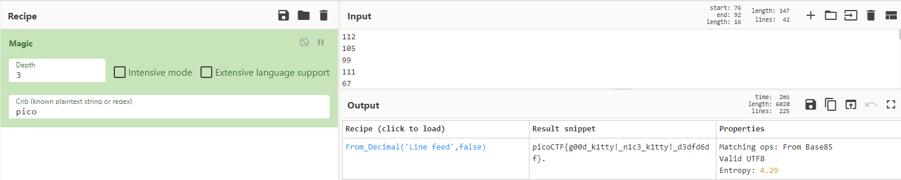

# Nice Netcat...
Author: dch0017

## Description
There is a nice program that you can talk to by using this command in a shell: $ nc mercury.picoctf.net 22902, but it doesn't speak English...

## Netcat
This challenge is clearly going to be a netcat challenge, and [netcat](https://netcat.sourceforge.net/) is a command line tool we can use to create TCP (or UDP) connections.

## Connecting
Let's make the connection using netcat and observe the output:
```console
┌──(kali㉿kali)-[~/GeneralSkills/NiceNetcat]
└─$ nc mercury.picoctf.net 22902
112
105
99
111
67
84
70
123
103
48
48
100
95
107
49
116
116
121
33
95
110
49
99
51
95
107
49
116
116
121
33
95
100
51
100
102
100
54
100
102
125
10
```

A string of numbers, which may be our flag encoded. There are a few ways to go from here.

## CyberChef
While we may be able to assume that the list of integers is just the decimal version of ASCII characters, one thing Cyberchef does really well is help you decode things that you may NOT know. This is a simple version but we can input our list on CyberChef, select the `Magic` operation, set our `Crib` as `pico` and we can see that the found recipe is in fact just a decimal conversion:</br>

</br>

## Bash
Also if we know from the star that it is decimal, we can easily do this in bash one liner:</br> 
We connect to the server using `netcat`, pipe that to a `while` loop that reads each line, then the while loop converts the decimal to ascii using `printf`. When it's all said and done it will look like this:

```console
┌──(kali㉿kali)-[~/GeneralSkills/NiceNetcat]
└─$ nc mercury.picoctf.net 22902 | while read line; do printf "\x$(printf %x $line)"; done
picoCTF{g00d_k1tty!_n1c3_k1tty!_d3dfd6df}
```
