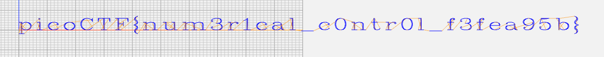

# speeds and feeds
Author: dch0017

## Challenge Description
There is something on my shop network running at nc mercury.picoctf.net 59953, but I can't tell what it is. Can you?

## Connecting to Machine
Once we connect to the machine using `nc` we get a long string of strange outputs:
```console
┌──(kali㉿kali)-[~]
└─$ nc mercury.picoctf.net 59953
G17 G21 G40 G90 G64 P0.003 F50
G0Z0.1
G0Z0.1
G0X0.8276Y3.8621
G1Z0.1
G1X0.8276Y-1.9310
G0Z0.1
G0X1.1034Y3.8621
G1Z0.1
G1X1.1034Y-1.9310
G0Z0.1
G0X1.1034Y3.0345
G1Z0.1
G1X1.6552Y3.5862
```

## G Code
The random strings made no sense to me, but Google came in clutch. With a quick search I could see that each string was referencing a command in [G-code](https://howtomechatronics.com/tutorials/g-code-explained-list-of-most-important-g-code-commands/) which is a language used for CNC machines and 3D printers.

Theoretically then, the above commands should make a pattern of some sort and we can work backwards from there.

## NC Viewer
I found a good site where you can input `G-code` and it will map it out for you at [NC Viewer](https://ncviewer.com/).

So I copy the output of our nc connection and throw it in the `GCode File` box and choose `plot` which gives us a nice drawing of our flag:</br>

</br>
