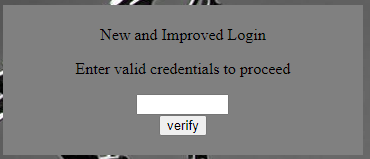

# Client-Side Again
Author: dch0017

## Challenge Description
Can you break into this super secure portal?

## Accessing Site
First we head over to site and see this </br>

</br>

## Always Check Source 
Just like the [first iteration](https://github.com/dch0017/PicoCTF/tree/main/Web%20Exploitation/Dont-Use-Client-Side) of this challenge, we see a javascript baked into the base HTML. They did at least obfuscate it a little this time, but I put it in a [deobfuscator](https://deobfuscate.io/) to prettify it:

```js
var _0x5a46 = ["37115}", "_again_3", "this", "Password Verified", "Incorrect password", "getElementById", "value", "substring", "picoCTF{", "not_this"];
(function (_0x4bd822, _0x2bd6f7) {
  var _0xb4bdb3 = function (_0x1d68f6) {
    while (--_0x1d68f6) {
      _0x4bd822.push(_0x4bd822.shift());
    }
  };
  _0xb4bdb3(++_0x2bd6f7);
}(_0x5a46, 435));
var _0x4b5b = function (_0x2d8f05, _0x4b81bb) {
  _0x2d8f05 = _0x2d8f05 - 0;
  var _0x4d74cb = _0x5a46[_0x2d8f05];
  return _0x4d74cb;
};
function verify() {
  checkpass = document[_0x4b5b("0x0")]("pass")[_0x4b5b("0x1")];
  split = 4;
  if (checkpass[_0x4b5b("0x2")](0, split * 2) == _0x4b5b("0x3")) {
    if (checkpass[_0x4b5b("0x2")](7, 9) == "{n") {
      if (checkpass[_0x4b5b("0x2")](split * 2, split * 2 * 2) == _0x4b5b("0x4")) {
        if (checkpass[_0x4b5b("0x2")](3, 6) == "oCT") {
          if (checkpass[_0x4b5b("0x2")](split * 3 * 2, split * 4 * 2) == _0x4b5b("0x5")) {
            if (checkpass.substring(6, 11) == "F{not") {
              if (checkpass[_0x4b5b("0x2")](split * 2 * 2, split * 3 * 2) == _0x4b5b("0x6")) {
                if (checkpass[_0x4b5b("0x2")](12, 16) == _0x4b5b("0x7")) {
                  alert(_0x4b5b("0x8"));
                }
              }
            }
          }
        }
      }
    }
  } else {
    alert(_0x4b5b("0x9"));
  }
}

```

## More Deobfuscation
Just looking at the array at the top, we could easily put together the flag but let's go through and further de-obfuscate. We can use Chrome's built in developer console to find these values. Take this for example, we set a variable ```myVar``` in the chrome console equal to the function variable ```_0x4b5b``` and then use that to de-code the rest of the js file. 

```console
>let myVar = _0x4b5b
<<undefined
>myVar("0x2")
<<'substring'
```

Effectively we can replace anywhere in the script that has ```_0x4b5b("0x2")``` with `'substring'`. Once we finish the js will look better, more importantly the ```verify``` function will be easier to follow:
```js
function verify() {
  checkpass = document['getElementById']("pass")['value'];
  4 = 4;
  if (checkpass['substring'](0, 8) == 'picoCTF{') {
    if (checkpass['substring'](7, 9) == "{n") {
      if (checkpass['substring'](8, 16) == 'not_this') {
        if (checkpass['substring'](3, 6) == "oCT") {
          if (checkpass['substring'](24, 32) == '37115}') {
            if (checkpass.substring(6, 11) == "F{not") {
              if (checkpass['substring'](16, 24) == '_again_3') {
                if (checkpass['substring'](12, 16) == 'this') {
                  alert('Password Verified');
                }
              }
            }
          }
        }
      }
    }
  } else {
    alert('Incorrect password');
  }
}
```
## Substrings
It's just a giant if ladder checking substrings, so let's find the substrings that are in sequential order to make it easy:
```(0,8) = 'picoCTF{'```
```(8,16) = 'not_this'```
```(16,24) = '_again_3'```
```(24, 32) = '37115}'```

## Flag
Put those together we get our flag:
```picoCTF{not_this_again_337115}```