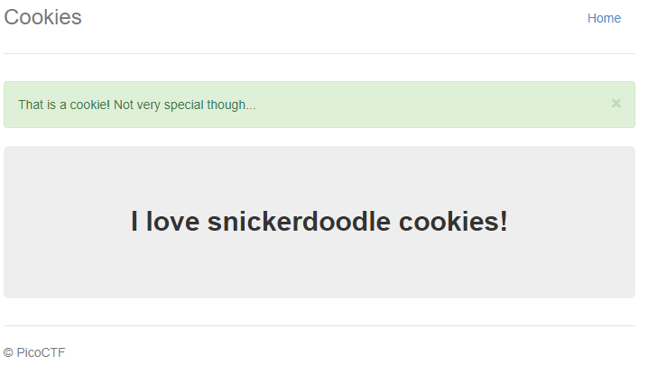
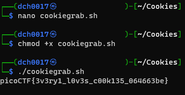

# Cookies
Author: dch0017

## Challenge Description
Who doesn't love cookies? Try to figure out the best one.

## Accessing Site
First we head over to site and see this </br>

</br>

I enter in "snickerdoodle" to the text box and hit Search, this page pulls up: </br>

</br>
## Where are the cookies?
So we see the page changes when entering cookie names and searching, but what about the site cookies? Going back to the homepage, I then open up Chrome's built in dev tools and pop open the network tab. When opening the homepage we have a default cookie 

``name=-1``

Running the search for "snickerdoodle" takes us to the previous page and we can see that our cookie does change.

``name=0``

## Incrementing Cookies
Without knowing how many cookies there are, we can write a quick bash script to loop through any number of cookies and grep out our flag.

I wrote this code in a Linux box and called it cookiegrab.sh
```
for i in {1..30}
do
 curl --silent --cookie "name=$i" -X GET "http://mercury.picoctf.net:27177/check" | grep -o "picoCTF{.*}"
done
```
Then I needed to change the permissions of the script to be able to run it using chmod, and then finally run it to get our flag.</br>

