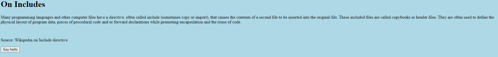

# Includes
Author: dch0017

## Challenge Description
Can you get the flag?

## Accessing Site
Here we see the site:</br>

</br>

## Includes
Inspecting the site in Chrome web dev tools: We see 2 additional files ```script.js``` and ```style.css```, and a quick examination of these appear to give us our flag.

### script.js
```js
function greetings()
{
  alert("This code is in a separate file!");
}

//  f7w_2of2_6edef411}

```
### style.css
```css
body {
  background-color: lightblue;
}

/*  picoCTF{1nclu51v17y_1of2_  */

```
### Flag
Put them together
```picoCTF{1nclu51v17y_1of2_f7w_2of2_6edef411} ```