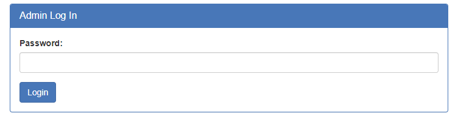
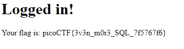

# Irish Name Repo 3
Author: dch0017

## Challenge Description
There is a website running at. Do you think you can log us in? Try to see if you can login!

## Accessing Site
Iteration 3 of this challenge: </br>

</br>

## Password Only
This login page only has a password field:</br>

</br>

But we should still follow the same path we used in the previous two.

## SQL Injection
Straight to SQL injection, we know what has worked in version 1 and 2 of this challenge. So let's go ahead and throw in the same payload we used the first time:

To do this we can use the following payload for our `password`: 
```
' or '1=1
```

and let's go ahead and use burpsuite to set our `debug` cookie to `1` as well.


## Login Failed
The login failed and we get to see our query, but something looks off:
```
password: ' or '1=1
SQL query: SELECT * FROM admin where password = '' be '1=1'
```

We can see that the password is supposed to be `' or '1=1` but in the SQL query our `or` is switched to `be`. If I had to guess it is a ROT13 swap. If I go to [ROT13.com](https://rot13.com/) and enter `or` it becomes `be` using `ROT13`.

## ROT13 
The nice thing about ROT13 is that if it swaps one way, it also goes the other way.

If we submit our `password` as:
```
' be '1=1
```

It should then be corrected in the SQL query to:
```
' or '1=1
```

## Flag



```
picoCTF{3v3n_m0r3_SQL_7f5767f6}
```