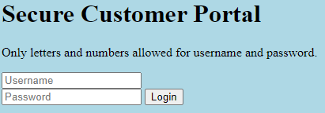
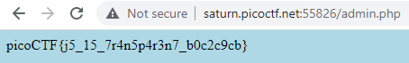

# Local Authority
Author: dch0017

## Challenge Description
Can you get the flag?

## Accessing Site
We get a login page when going to the site:</br>

</br>

Not much on here, an ```index.html``` and a ```style.css``` but nothing useful inside them. lets try to log in with a fake account like ```admin``` for username and ```password``` for password.

## New File
Now we are taken to a log in failed page, but in our web dev console (Chrome) we see a new file pop up. ```secure.js```. Inside that file we see:
```js
function checkPassword(username, password)
{
  if( username === 'admin' && password === 'strongPassword098765' )
  {
    return true;
  }
  else
  {
    return false;
  }
}
```


## Logged In
In plaintext username and password? Let's try that on the login page:</br>

</br>

and there's our flag!
