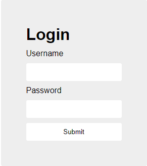
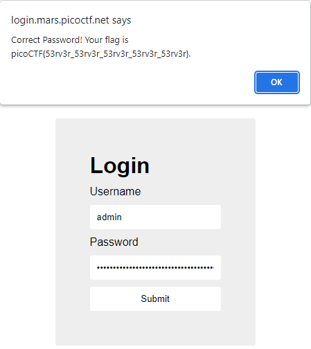

# login
Author: dch0017

## Challenge Description
My dog-sitter's brother made this website but I can't get in; can you help?

## Website
Let's pull up the site and here is what we get:</br>

</br>

Okay, a login page. Let's check the sources in our web dev tools (Chrome). We see that there are 3 files, an ```index.html```, an ```index.js```, and a ```style.css```.

A quick look of the ```index.html``` and the ```style.css``` don't show anything useful.

## Index.js

The ```index.js``` on the other hand looks interesting. After putting it in a [javascript deobfuscator/prettifier](https://deobfuscate.io/) we get:

```js
(async () => {
  await new Promise(e => window.addEventListener("load", e)), document.querySelector("form").addEventListener("submit", e => {
    e.preventDefault();
    const r = {u: "input[name=username]", p: "input[name=password]"}, t = {};
    for (const e in r) t[e] = btoa(document.querySelector(r[e]).value).replace(/=/g, "");
    return "YWRtaW4" !== t.u ? alert("Incorrect Username") : "cGljb0NURns1M3J2M3JfNTNydjNyXzUzcnYzcl81M3J2M3JfNTNydjNyfQ" !== t.p ? alert("Incorrect Password") : void alert(`Correct Password! Your flag is ${atob(t.p)}.`);
  });
})();

```

To break what the script is doing: It appears to take the username and password inputs and supply them to a ```btoa``` method. Then it removes any ```=``` signs. After that it checks to see if the modified username is equal to ```YWRtaW4``` and if the password is equal to ```cGljb0NURns1M3J2M3JfNTNydjNyXzUzcnYzcl81M3J2M3JfNTNydjNyfQ ```. </br>

## Base64
Looking at the [Mozilla Developer docs](https://developer.mozilla.org/en-US/docs/Web/API/btoa), ```btoa``` is a method that converts a string to base64. So these two values we have should be the base64 encoded versions of our username and password.

## Decoded
With the ```base64``` command-line tool it can be picky about padding characters. So our strings need to be divisible by 4 to not throw an error. Since ```YWRtaW4``` is only 7 characters we add 1 padding character of ```=``` and 2 for the password value.

```console
┌──(dch0017㉿linux)-[~]
└─$ echo -n "YWRtaW4=" | base64 -d
admin
┌──(dch0017㉿linux)-[~]
└─$ echo -n "cGljb0NURns1M3J2M3JfNTNydjNyXzUzcnYzcl81M3J2M3JfNTNydjNyfQ==" | base64 -d
picoCTF{53rv3r_53rv3r_53rv3r_53rv3r_53rv3r}

```

## Login and Flag
Well we already appear to have the flag, but let's log in anyways to see what we get.</br>

</br>

After logging in we confirmed we do have the flag.
```picoCTF{53rv3r_53rv3r_53rv3r_53rv3r_53rv3r} ```