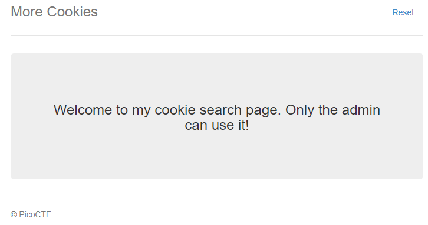
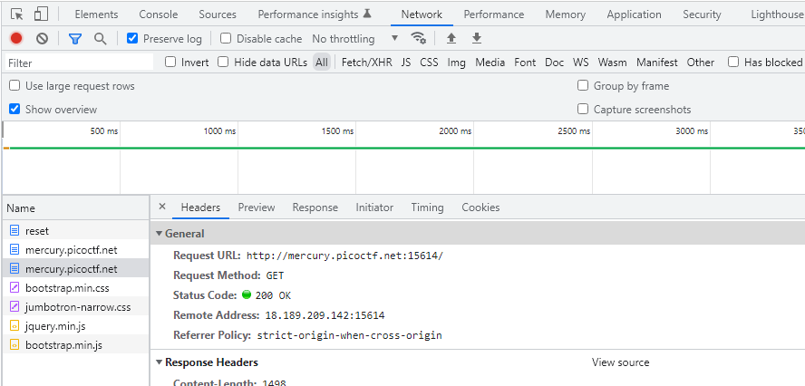

# More Cookies
Author: dch0017

## Challenge Description
I forgot Cookies can Be modified Client-side, so now I decided to encrypt them!

## Accessing Site
First we head to the site and we are greeted by this: </br>

</br>

A quick runthrough of the sources on the page doesn't give us anything interesting.

There is a sole ```Reset``` button on the page. Let's open up our network tools (Chrome for me) and see what actually happens when we hit the button.

## Requests and Cookies
<br>

</br>

The reset button pushes a GET request to ```http://mercury.picoctf.net:15614/reset```, and in turn our token ```auth_name``` is cleared.</br>

Then a GET request is made to ```http://mercury.picoctf.net:15614/``` and we get back a new token, again named ```auth_token```. After we get this we are redirected to the site above.</br>

Our initial cookie looks like this: ```auth_name=eStwQ0NzWUhZNEM2blgvUWE2ZXl1U05vQ1I3Rk0xZVFOZ2JrOHgxR1hVaXlUSkFrbzZvWDRwR040c044eGhJNDN2ODUxYlZpKzQ1L0k1VFZmbkZUanA2R0ttSEhhRXhOWm5velZFOGUrNDF0TXk3eVdQUk9KdHIrRTZ4M0hiYmY=```

Attempting to decode from Base64, does not give us anything useful as the string is encrypted. 

## Encrypted Cookie
We know the cookie is encrypted and this is where I got stuck. So I went to hint 1 and it pointed me towards this Wikipedia article on [homomorphic encryption](https://en.wikipedia.org/wiki/Homomorphic_encryption).

From my understanding of it, if you have an encrypted string and were to do some calculations or change values on the encrypted string it would mess up your plaintext wildly. With homomorphic encryption, you can perform mathematical calculations on an encrypted text that used homomorphic encryption and it would be equally changed in plaintext. 

## Cipher-Block Chaining
Based off the letters CBC being capitalized weirdly in the description, we can infer that Cipher-Block Chaining (CBC) is being used. More on CBC [here](http://en.wikipedia.org/wiki/Block_cipher_mode_of_operation). 

More importantly, is that CBC is vulnerable to a ```bitflip``` attack. This is changing a byte in ciphertext and in turn editing the plaintext. A very good write up on the attack is on this page from [InfoSec Institute](https://resources.infosecinstitute.com/topic/cbc-byte-flipping-attack-101-approach/).


## Tie it together
So how do those two things affect this challenge? Well if we know that we have an encrypted string (that can have operations performed on it), and we know it is vulnerable to a bitflip attack, then there must be an indicator in the cookie that represents us being an admin or not. It could be ```admin:0``` for a regular user and ```admin:1`` for an admin. All we need to do is get that numerical value changed, but we don't know where that value lies in our cookie.

## Writing a script
</br>
The basis of this script come from user, kelalaka153 on [GitHub](https://github.com/kelalaka153/CBC-Bit-Flipping-Attack)

In short, this script will grab a cookie from the site, run the cookie through the bitFlip function which XOR's the current position in the list to a bit 1-8. 
```python
from base64 import b64decode, b64encode
import requests

CTF_PAGE = "http://mercury.picoctf.net:15614/"

session = requests.Session()
session.get(CTF_PAGE)
encrypted_cookie = session.cookies["auth_name"]

def bitFlip( pos, bit, data):
    raw = b64decode(b64decode(data).decode())

    list1 = bytearray(raw)
    list1[pos] = list1[pos] ^ bit
    raw = bytes(list1)
    return b64encode(b64encode(raw)).decode()


for i in range(len(encrypted_cookie)):
    for j in range(8):
        bitflipped_cookie = bitFlip(i, j, encrypted_cookie)
        request = requests.get(CTF_PAGE, cookies={"auth_name": bitflipped_cookie})
        if "picoCTF{" in request.text:
            print(request.text)

```

### Flag
and after some time we get our cookie printed out:

```
picoCTF{cO0ki3s_yum_a9a19fa6}
```