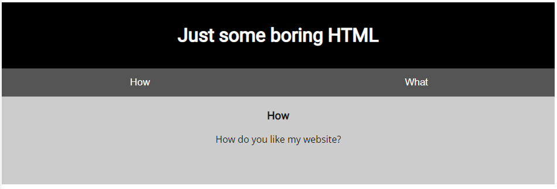
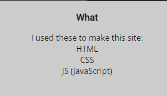
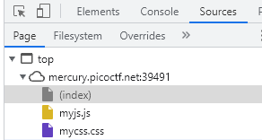

# Scavenger Hunt
Author: dch0017

## Challenge Description
There is some interesting information hidden around this site. Can you find it?

## Accessing Site
First we head to the site and we are greeted by this: </br>

</br>

Clicking on the 'What' tab, we stay on the same page but this is shown:</br>

</br>

## Looking Under The Hood
If we inspect using Chrome's built in dev tools, we can see 3 files: the index.html, myjs.js, and mycss.cs. </br>

</br>

### Index.html
Looking at the index.html first, we find part 1 of the flag.
```html
<!doctype html>
<html>
  <head>
    <title>Scavenger Hunt</title>
    <link href="https://fonts.googleapis.com/css?family=Open+Sans|Roboto" rel="stylesheet">
    <link rel="stylesheet" type="text/css" href="mycss.css">
    <script type="application/javascript" src="myjs.js"></script>
  </head>

  <body>
    <div class="container">
      <header>
		<h1>Just some boring HTML</h1>
      </header>

      <button class="tablink" onclick="openTab('tabintro', this, '#222')" id="defaultOpen">How</button>
      <button class="tablink" onclick="openTab('tababout', this, '#222')">What</button>

      <div id="tabintro" class="tabcontent">
		<h3>How</h3>
		<p>How do you like my website?</p>
      </div>

      <div id="tababout" class="tabcontent">
		<h3>What</h3>
		<p>I used these to make this site: <br/>
		  HTML <br/>
		  CSS <br/>
		  JS (JavaScript)
		</p>
	<!-- Here's the first part of the flag: picoCTF{t -->
      </div>

    </div>

  </body>
</html>

```
### mycss.css
We then move over to the mycss.css, and there is part 2!</br>
```css
div.container {
    width: 100%;
}

header {
    background-color: black;
    padding: 1em;
    color: white;
    clear: left;
    text-align: center;
}

body {
    font-family: Roboto;
}

h1 {
    color: white;
}

p {
    font-family: "Open Sans";
}

.tablink {
    background-color: #555;
    color: white;
    float: left;
    border: none;
    outline: none;
    cursor: pointer;
    padding: 14px 16px;
    font-size: 17px;
    width: 50%;
}

.tablink:hover {
    background-color: #777;
}

.tabcontent {
    color: #111;
    display: none;
    padding: 50px;
    text-align: center;
}

#tabintro { background-color: #ccc; }
#tababout { background-color: #ccc; }

/* CSS makes the page look nice, and yes, it also has part of the flag. Here's part 2: h4ts_4_l0 */
```

### myjs.js
Then we step over to the myjs.js file, we don't see any flag here but we do get a tip:

```js
function openTab(tabName,elmnt,color) {
    var i, tabcontent, tablinks;
    tabcontent = document.getElementsByClassName("tabcontent");
    for (i = 0; i < tabcontent.length; i++) {
	tabcontent[i].style.display = "none";
    }
    tablinks = document.getElementsByClassName("tablink");
    for (i = 0; i < tablinks.length; i++) {
	tablinks[i].style.backgroundColor = "";
    }
    document.getElementById(tabName).style.display = "block";
    if(elmnt.style != null) {
	elmnt.style.backgroundColor = color;
    }
}

window.onload = function() {
    openTab('tabintro', this, '#222');
}

/* How can I keep Google from indexing my website? */

```

## Following Clues

Lets follow the rabbit trail to the carrot. 
### Domo Arigato, Mr. Roboto

We may (or may not) know that a robots.txt file is used to let crawlers know which URLs the crawler "should" index on your site. It also states which user-agents are allowed to access the site. I then checked to see if the site had a robots.txt file and sure enough it did. 
```
User-agent: *
Disallow: /index.html
# Part 3: t_0f_pl4c
# I think this is an apache server... can you Access the next flag?
```
Part 3 of the flag and another hint.

### Apache
Using a little google-fu, I found that apache servers have .htaccess files which are default configuration files. The names can be changed but for this challenge, I just tried directly accessing the .htaccess and it worked. 

```
# Part 4: 3s_2_lO0k
# I love making websites on my Mac, I can Store a lot of information there.
```
Part 4 locked down, and onward we go.

### Mac?
I'll be real, I haven't used a Mac in a while but I do know people that do and I also know every folder has a hidden file that stores metadata. I couldn't remember exactly what it stored or what but a quick Goog shows me that the .DS_Store file on Mac is that hidden folder. Now knowing this, I went ahead and tried to access .DS_Store and it broght me the final piece to our puzzle.

```
Congrats! You completed the scavenger hunt. Part 5: _f7ce8828}
```
Now to just put it all together.

## Flag
picoCTF{th4ts_4_l0t_0f_pl4c_f7ce8828}
