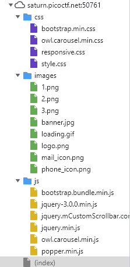
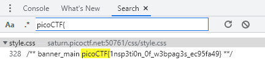

# Search Source
Author: dch0017

## Challenge Description
The developer of this website mistakenly left an important artifact in the website source, can you find it?

## Accessing Site
First we head to the site and we are greeted by this: </br>

</br>

## Sources
Since the challenge is search source, I think there will be some hints in the source files. I opened up my chrome dev web tools and I'm greeted by quite a few files: </br>

</br>

Before we parse each one manually, let's do a quick search through all the files to see if we find anything using the format ```picoCTF{``` and we do get a hit:</br>

</br>

It looks like we found the flag pretty easy, and it is sitting on line 328 of the ```style.css``` file.

### Flag
```
picoCTF{1nsp3ti0n_0f_w3bpag3s_ec95fa49}
```