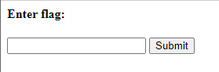

# Some Assembly Required
Author: dch0017

## Challenge Description
Description

## Accessing Site
Getting onto the site we see a very basic text input box and a submit button. </br>

</br>

Digging into the sources we see a single line javascript file. To try and get a grasp of what's going on, I took that and put it in a [javascript deobfuscator](jsnice.org) to get:
```js
'use strict';
const _0x402c = ["value", "2wfTpTR", "instantiate", "275341bEPcme", "innerHTML", "1195047NznhZg", "1qfevql", "input", "1699808QuoWhA", "Correct!", "check_flag", "Incorrect!", "./JIFxzHyW8W", "23SMpAuA", "802698XOMSrr", "charCodeAt", "474547vVoGDO", "getElementById", "instance", "copy_char", "43591XxcWUl", "504454llVtzW", "arrayBuffer", "2NIQmVj", "result"];
const _0x4e0e = function(url, whensCollection) {
  /** @type {number} */
  url = url - 470;
  let _0x402c6f = _0x402c[url];
  return _0x402c6f;
};
(function(data, oldPassword) {
  const toMonths = _0x4e0e;
  for (; !![];) {
    try {
      const userPsd = -parseInt(toMonths(491)) + parseInt(toMonths(493)) + -parseInt(toMonths(475)) * -parseInt(toMonths(473)) + -parseInt(toMonths(482)) * -parseInt(toMonths(483)) + -parseInt(toMonths(478)) * parseInt(toMonths(480)) + parseInt(toMonths(472)) * parseInt(toMonths(490)) + -parseInt(toMonths(485));
      if (userPsd === oldPassword) {
        break;
      } else {
        data["push"](data["shift"]());
      }
    } catch (_0x41d31a) {
      data["push"](data["shift"]());
    }
  }
})(_0x402c, 627907);
let exports;
(async() => {
  const findMiddlePosition = _0x4e0e;
  let leftBranch = await fetch(findMiddlePosition(489));
  let rightBranch = await WebAssembly[findMiddlePosition(479)](await leftBranch[findMiddlePosition(474)]());
  let module = rightBranch[findMiddlePosition(470)];
  exports = module["exports"];
})();
/**
 * @return {undefined}
 */
function onButtonPress() {
  const navigatePop = _0x4e0e;
  let params = document["getElementById"](navigatePop(484))[navigatePop(477)];
  for (let i = 0; i < params["length"]; i++) {
    exports[navigatePop(471)](params[navigatePop(492)](i), i);
  }
  exports["copy_char"](0, params["length"]);
  if (exports[navigatePop(487)]() == 1) {
    document[navigatePop(494)](navigatePop(476))[navigatePop(481)] = navigatePop(486);
  } else {
    document[navigatePop(494)](navigatePop(476))[navigatePop(481)] = navigatePop(488);
  }
}
;
```

Still a mess, but we can use Chrome's built in console to run various calls of  navigatePop(), findMiddlePosition(), and toMonths():

```js
>>>const navigatePop = _0x4e0e;
undefined
>>>navigatePop(477)
'value'
```
Now we can replace all instances of `navigatePop(477)` with `'value'` and so on..

After all that is done, we are left with this ():
```js
const _0x4e0e = function(url, whensCollection) {
  /** @type {number} */
  url = url - 470;
  let _0x402c6f = _0x402c[url];
  return _0x402c6f;
};
(function(data, oldPassword) {
  const toMonths = _0x4e0e;
  for (; !![];) {
    try {
      const userPsd = -parseInt('802698XOMSrr') + parseInt(toMonths(493)) + -parseInt(toMonths(475)) * -parseInt(toMonths(473)) + -parseInt(toMonths(482)) * -parseInt(toMonths(483)) + -parseInt(toMonths(478)) * parseInt(toMonths(480)) + parseInt(toMonths(472)) * parseInt(toMonths(490)) + -parseInt(toMonths(485));
      if (userPsd === oldPassword) {
        break;
      } else {
        data["push"](data["shift"]());
      }
    } catch (_0x41d31a) {
      data["push"](data["shift"]());
    }
  }
})(_0x402c, 627907);
let exports;
(async() => {
  const findMiddlePosition = _0x4e0e;
  let leftBranch = await fetch('./JIFxzHyW8W');
  let rightBranch = await WebAssembly['instantiate'](await leftBranch['arrayBuffer']());
  let module = rightBranch['instance'];
  exports = module["exports"];
})();
/**
 * @return {undefined}
 */
function onButtonPress() {
  const navigatePop = _0x4e0e;
  let params = document["getElementById"]('input')['value'];
  for (let i = 0; i < params["length"]; i++) {
    exports['copy_char'](params['charCodeAt'](i), i);
  }
  exports["copy_char"](0, params["length"]);
  if (exports['check_flag']() == 1) {
    document['getElementById']('result')['innerHTML'] = 'Correct!';
  } else {
    document['getElementById']('result')['innerHTML'] = 'Incorrect!';
  }
}

```
Note: I did not finish as I noticed something interesting in the findMiddlePosition section which looked like a file path.

## Getting our file
 After poking around and trying to get a grasp of what the script was doing (any knowledge of WebAssembly or JS is minimal here), it goes character by character in the user input and supplies it to check if it matches the flag. So let's grab that web assembly file and see what it is.

 ```console
┌──(dch0017㉿linux)-[~/SomeAssemblyRequired1]
└─$ wget http://mercury.picoctf.net:26318/JIFxzHyW8W -q -O webassembly
 ```

 After that I cat out the file, and it has the flag in plaintext at the bottom!

 ```console
─(dch0017㉿DESKTOP-PCNHS4C)-[~/SomeAssemblyRequired1]
└─$ cat webassembly
asm````pA��
                                      A�
                                       A�
                                        A�

A�
 A��
     A
      A
        �
          memory__wasm_call_ctorsstrcmp
check_flaginput     copy_char
                                  __dso_handle
__global_base
__memory_base__heap_base
               __table_base
�
    �*#����!A !  k!  6  6 (!  6 (!  6
                                                                  @@ (!A j!              6 -!
 
:
  (
     !
      A!


6         j!

   -!  :
 -
 -!A�!  q!@ 
   !A�!  q! -
!A�!  q!  k!  6
                            
                              -
                               !A�!  q!

    �!  q! !!A!" ! "q!# #
 -
   !$A�!% $ %q!& -
!'A�!( ' (q!) & )k!*  *6
                             (!+ +
                                     L
                                       A!A����!A����!  ����! ! !  G!A!  sA!            q!


?#����!A!  k!  6
                            6 (
                                   ! (!  :����

                                                   2A�
                                                      +picoCTF{8857462f9e30faae4d037e5e25fee1ce}
 ```

 I ran a file command on the file to see that it was a WebAssembly binary module, but that seems like a problem for future me.
 ```console
┌──(dch0017㉿linux)-[~/SomeAssemblyRequired1]
└─$ file webassembly
webassembly: WebAssembly (wasm) binary module version 0x1 (MVP)
 ```

 ## The Flag
 Now to get the flag nice and clean, I just re-ran my cat command with a grep added.
 ```console
┌──(dch0017㉿linux)-[~/SomeAssemblyRequired1]
└─$ cat webassembly | grep -o "picoCTF{.*}" -a --color=none
picoCTF{8857462f9e30faae4d037e5e25fee1ce}
 ```