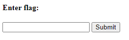
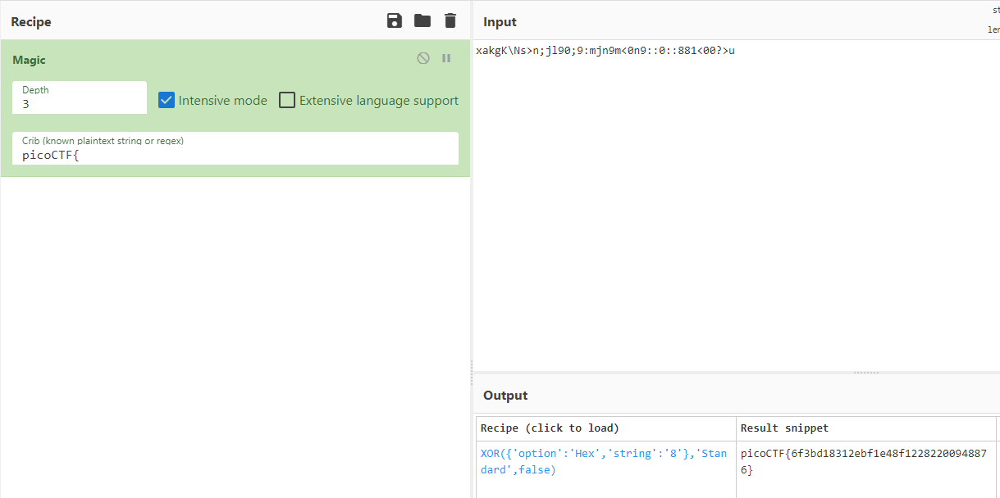

# Some Assembly Required 2
Author: dch0017

## Challenge Description
Description

## Accessing Site
Getting onto the site we see a very basic text input box and a submit button. </br>

</br>

## Custom Javascript
I open up Chrome's web dev tools and we see a weird js file: ```Y8splx37qY.js```</br>


To try and get a grasp of what's going on, I took that and put it in a [javascript deobfuscator](https://jsnice.org) to get:
```js
'use strict';
const _0x6d8f = ["copy_char", "value", "207aLjBod", "1301420SaUSqf", "233ZRpipt", "2224QffgXU", "check_flag", "408533hsoVYx", "instance", "278338GVFUrH", "Correct!", "549933ZVjkwI", "innerHTML", "charCodeAt", "./aD8SvhyVkb", "result", "977AzKzwq", "Incorrect!", "exports", "length", "getElementById", "1jIrMBu", "input", "615361geljRK"];
const _0x5c00 = function(url, whensCollection) {
  /** @type {number} */
  url = url - 195;
  let _0x6d8fc4 = _0x6d8f[url];
  return _0x6d8fc4;
};
(function(data, oldPassword) {
  const toMonths = _0x5c00;
  for (; !![];) {
    try {
      const userPsd = -parseInt(toMonths(200)) * -parseInt(toMonths(201)) + -parseInt(toMonths(205)) + parseInt(toMonths(207)) + parseInt(toMonths(195)) + -parseInt(toMonths(198)) * parseInt(toMonths(212)) + parseInt(toMonths(203)) + -parseInt(toMonths(217)) * parseInt(toMonths(199));
      if (userPsd === oldPassword) {
        break;
      } else {
        data["push"](data["shift"]());
      }
    } catch (_0x4f8a) {
      data["push"](data["shift"]());
    }
  }
})(_0x6d8f, 310022);
let exports;
(async() => {
  const edgeId = _0x5c00;
  let _0x1adb5f = await fetch(edgeId(210));
  let rpm_traffic = await WebAssembly["instantiate"](await _0x1adb5f["arrayBuffer"]());
  let updatedEdgesById = rpm_traffic[edgeId(204)];
  exports = updatedEdgesById[edgeId(214)];
})();
/**
 * @return {undefined}
 */
function onButtonPress() {
  const navigatePop = _0x5c00;
  let params = document[navigatePop(216)](navigatePop(218))[navigatePop(197)];
  for (let i = 0; i < params["length"]; i++) {
    exports[navigatePop(196)](params[navigatePop(209)](i), i);
  }
  exports["copy_char"](0, params[navigatePop(215)]);
  if (exports[navigatePop(202)]() == 1) {
    document["getElementById"](navigatePop(211))[navigatePop(208)] = navigatePop(206);
  } else {
    document[navigatePop(216)](navigatePop(211))["innerHTML"] = navigatePop(213);
  }
};
```

## Further de-obfuscate
Very messy still, but we can use chrome's built in console to plug in some values on the page. Such as we know that 
```js
const navigatePop = _0x5c00;
```

Browsing through the file we see that ```_0x5c00``` is a function, so in turn we can run the following from our chrome console:
```js
>> const navigatePop = _0x5c00
undefined
>> navigatePop(210)
'./aD8SvhyVkb'
```
Then it's just a matter of doing that over and over again to get a cleaner JS:

```js
'use strict';
const _0x6d8f = ["copy_char", "value", "207aLjBod", "1301420SaUSqf", "233ZRpipt", "2224QffgXU", "check_flag", "408533hsoVYx", "instance", "278338GVFUrH", "Correct!", "549933ZVjkwI", "innerHTML", "charCodeAt", "./aD8SvhyVkb", "result", "977AzKzwq", "Incorrect!", "exports", "length", "getElementById", "1jIrMBu", "input", "615361geljRK"];
const _0x5c00 = function(url, whensCollection) {
  /** @type {number} */
  url = url - 195;
  let _0x6d8fc4 = _0x6d8f[url];
  return _0x6d8fc4;
};
(function(data, oldPassword) {
  const toMonths = _0x5c00;
  for (; !![];) {
    try {
      const userPsd = 310022;
      if (userPsd === oldPassword) {
        break;
      } else {
        data["push"](data["shift"]());
      }
    } catch (_0x4f8a) {
      data["push"](data["shift"]());
    }
  }
})(_0x6d8f, 310022);
let exports;
(async() => {
  const edgeId = _0x5c00;
  let _0x1adb5f = await fetch("./aD8SvhyVkb");
  let rpm_traffic = await WebAssembly["instantiate"](await _0x1adb5f["arrayBuffer"]());
  let updatedEdgesById = rpm_traffic["instance"];
  exports = updatedEdgesById["exports"];
})();
/**
 * @return {undefined}
 */
function onButtonPress() {
  const navigatePop = _0x5c00;
  let params = document["getElementById"]("input")["value"];
  for (let i = 0; i < params["length"]; i++) {
    exports["copy_char"](params["charCodeAt"](i), i);
  }
  exports["copy_char"](0, params["length"]);
  if (exports["check_flag"]() == 1) {
    document["getElementById"]("result")["innerHTML"] = "Correct!";
  } else {
    document["getElementById"]("result")["innerHTML"] = "Incorrect!";
  }
}
;
```


## A new file
One interesting part of the newly de-obfuscated js is the reference to an apparent file ```./aD8SvhyVkb```. So I tried to pull down that file from the site and then run the ```file``` command on it:
```console
┌──(dch0017㉿linux)-[~/WebExploit/SomeAssembly2]
└─$ wget http://mercury.picoctf.net:53929/aD8SvhyVkb -O someassemblyfile

┌──(dch0017㉿linux)-[~/WebExploit/SomeAssembly2]
└─$ file someassemblyfile
someassemblyfile: WebAssembly (wasm) binary module version 0x1 (MVP)
```

## WebAssembly 
So what is WebAssembly? In short, WebAssembly lets developrs run C/C++ on webpage with native performance which in turn is faster than plain javascript. The issue that comes along with this is the vulnerabilities found in C/C++ such as buffer overflows. A paper on this topic by Pedro Daniel Rogeiro Lopes can be found [here](https://syssec.gsd.inesc-id.pt/projects/tr-wasmati.pdf).


We can convert our downloaded file to pseudo-code using ```wasm-decompile```.

```console
wasm-decompile someassemblyfile -o decompiled.c
```

And then here are the contents of our ```decompiled.c``` file:
```c
export memory memory(initial: 2, max: 0);

global g_a:int = 66864;
export global input:int = 1072;
export global dso_handle:int = 1024;
export global data_end:int = 1328;
export global global_base:int = 1024;
export global heap_base:int = 66864;
export global memory_base:int = 0;
export global table_base:int = 1;

table T_a:funcref(min: 1, max: 1);

data d_xakgKNsnjl909mjn9m0n9088100u(offset: 1024) =
"xakgK\Ns>n;jl90;9:mjn9m<0n9::0::881<00?>u\00\00 ";

export function wasm_call_ctors() {
}

export function strcmp(a:int, b:int):int {
  var c:int = g_a;
  var d:int = 32;
  var e:int = c - d;
  e[6]:int = a;
  e[5]:int = b;
  var f:int = e[6]:int;
  e[4]:int = f;
  var g:int = e[5]:int;
  e[3]:int = g;
  loop L_b {
    var h:ubyte_ptr = e[4]:int;
    var i:int = 1;
    var j:int = h + i;
    e[4]:int = j;
    var k:int = h[0];
    e[11]:byte = k;
    var l:ubyte_ptr = e[3]:int;
    var m:int = 1;
    var n:int = l + m;
    e[3]:int = n;
    var o:int = l[0];
    e[10]:byte = o;
    var p:int = e[11]:ubyte;
    var q:int = 255;
    var r:int = p & q;
    if (r) goto B_c;
    var s:int = e[11]:ubyte;
    var t:int = 255;
    var u:int = s & t;
    var v:int = e[10]:ubyte;
    var w:int = 255;
    var x:int = v & w;
    var y:int = u - x;
    e[7]:int = y;
    goto B_a;
    label B_c:
    var z:int = e[11]:ubyte;
    var aa:int = 255;
    var ba:int = z & aa;
    var ca:int = e[10]:ubyte;
    var da:int = 255;
    var ea:int = ca & da;
    var fa:int = ba;
    var ga:int = ea;
    var ha:int = fa == ga;
    var ia:int = 1;
    var ja:int = ha & ia;
    if (ja) continue L_b;
  }
  var ka:int = e[11]:ubyte;
  var la:int = 255;
  var ma:int = ka & la;
  var na:int = e[10]:ubyte;
  var oa:int = 255;
  var pa:int = na & oa;
  var qa:int = ma - pa;
  e[7]:int = qa;
  label B_a:
  var ra:int = e[7]:int;
  return ra;
}

export function check_flag():int {
  var a:int = 0;
  var b:int = 1072;
  var c:int = 1024;
  var d:int = strcmp(c, b);
  var e:int = d;
  var f:int = a;
  var g:int = e != f;
  var h:int = -1;
  var i:int = g ^ h;
  var j:int = 1;
  var k:int = i & j;
  return k;
}

function copy(a:int, b:int) {
  var c:int = g_a;
  var d:int = 16;
  var e:int_ptr = c - d;
  e[3] = a;
  e[2] = b;
  var f:int = e[3];
  if (eqz(f)) goto B_a;
  var g:int = e[3];
  var h:int = 8;
  var i:int = g ^ h;
  e[3] = i;
  label B_a:
  var j:int = e[3];
  var k:byte_ptr = e[2];
  k[1072] = j;
}
```
## Decoding 
A few functions in here, but what pulls my eye is the declaration near the top:
```c
data d_xakgKNsnjl909mjn9m0n9088100u(offset: 1024) = "xakgK\Ns>n;jl90;9:mjn9m<0n9::0::881<00?>u\00\00";
```

If you did the first challenge "Some Assembly Required 1", the flag was in plaintext in our web assembly file. Now it seems to be encoded. That's all good, we can throw it into cyberchef and run some ```Magic``` on it and set our known plaintext to ```PicoCTF{```:</br>

</br>

## Flag Found
Here we can see we found our flag and it was XOR'd with 8. Decoded our flag is:

```
picoCTF{6f3bd18312ebf1e48f12282200948876}
```
