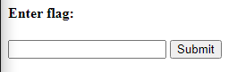
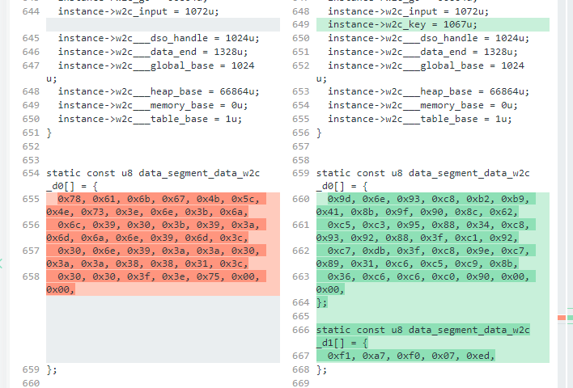
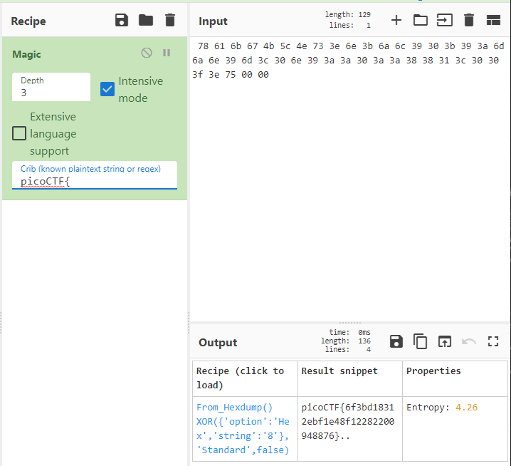
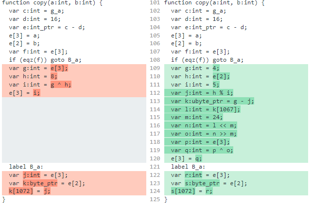
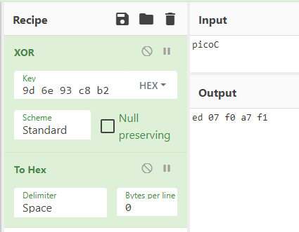
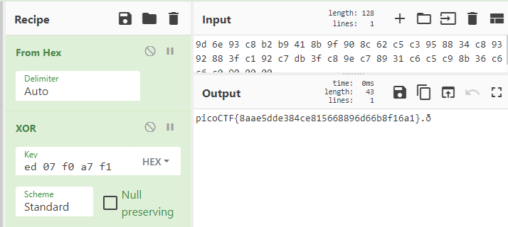

# Some Assembly Required 3
Author: dch0017

## Challenge Description
Description

## Accessing Site
Getting onto the site we see a very basic text input box and a submit button like the other 2 iterations of this challenge. </br>

</br>

## Custom Javascript
I open up Chrome's web dev tools and we see a weird js file: ```rTEuOmSfG3.js```</br>

To try and get a grasp of what's going on, I took that and put it in a [javascript deobfuscator](https://deobfuscate.io/) to get:
```js
const _0x143f = ["exports", "270328ewawLo", "instantiate", "1OsuamQ", "Incorrect!", "length", "copy_char", "value", "1512517ESezaM", "innerHTML", "check_flag", "result", "1383842SQRPPf", "924408cukzgO", "getElementById", "418508cLDohp", "input", "Correct!", "573XsMMHp", "arrayBuffer", "183RUQBDE", "38934oMACea"];
const _0x187e = function (_0x3075b9, _0x2ac888) {
  _0x3075b9 = _0x3075b9 - 285;
  let _0x143f7d = _0x143f[_0x3075b9];
  return _0x143f7d;
};
(function (_0x3379df, _0x252604) {
  const _0x1e2b12 = _0x187e;
  while (true) {
    try {
      const _0x5e2d0a = -parseInt(_0x1e2b12(290)) + -parseInt(_0x1e2b12(303)) + -parseInt(_0x1e2b12(294)) * -parseInt(_0x1e2b12(299)) + -parseInt(_0x1e2b12(306)) + parseInt(_0x1e2b12(292)) + -parseInt(_0x1e2b12(289)) * -parseInt(_0x1e2b12(287)) + parseInt(_0x1e2b12(304));
      if (_0x5e2d0a === _0x252604) break; else _0x3379df.push(_0x3379df.shift());
    } catch (_0x289152) {
      _0x3379df.push(_0x3379df.shift());
    }
  }
}(_0x143f, 970828));
let exports;
(async () => {
  const _0x484ae0 = _0x187e;
  let _0x487b31 = await fetch("./qCCYI0ajpD"), _0x5eebfd = await WebAssembly[_0x484ae0(293)](await _0x487b31[_0x484ae0(288)]()), _0x30f3ed = _0x5eebfd.instance;
  exports = _0x30f3ed[_0x484ae0(291)];
})();
function onButtonPress() {
  const _0x271e58 = _0x187e;
  let _0x441124 = document[_0x271e58(305)](_0x271e58(285))[_0x271e58(298)];
  for (let _0x34c54a = 0; _0x34c54a < _0x441124[_0x271e58(296)]; _0x34c54a++) {
    exports[_0x271e58(297)](_0x441124.charCodeAt(_0x34c54a), _0x34c54a);
  }
  exports[_0x271e58(297)](0, _0x441124[_0x271e58(296)]), exports[_0x271e58(301)]() == 1 ? document[_0x271e58(305)](_0x271e58(302))[_0x271e58(300)] = _0x271e58(286) : document[_0x271e58(305)](_0x271e58(302)).innerHTML = _0x271e58(295);
}

```

## Grabbing file
Rather than go through the whole de-obfuscation of the js like we did in part 1 and 2, we see a new path in the js which should lead us to a file. ```./qCCYI0ajpD```

If we try to grab that file and run ```file``` on it we see that it is a WebAssembly binary module:
```console
┌──(dch0017㉿linux)-[~/WebExploit/SomeAssembly3]
└─$ wget http://mercury.picoctf.net:60154/qCCYI0ajpD -O someassemblyfile3 -q

┌──(dch0017㉿linux)-[~/WebExploit/SomeAssembly3]
└─$ file someassemblyfile3
someassemblyfile: WebAssembly (wasm) binary module version 0x1 (MVP)

```

## WebAssembly Recap
So what is WebAssembly? In short, WebAssembly lets developers run C/C++ on webpage with native performance which in turn is faster than plain javascript. The issue that comes along with this is the vulnerabilities found in C/C++ such as buffer overflows. A paper on this topic by Pedro Daniel Rogeiro Lopes can be found [here](https://syssec.gsd.inesc-id.pt/projects/tr-wasmati.pdf).


We can convert our downloaded file to pseudo-code using ```wasm-decompile```.

```console
wasm-decompile someassemblyfile3 -o decompiled3.c
```

## Referencing Old Versions
I played around in the pseudo code file I had: ```decompiled3.c``` for a while but I couldn't find much info. I did see a great tip after doing the previous challenge ```Some Assembly Required 2``` of someone who had actually used ```wasm2c``` and turned the binary WASM files into C-code files and compared it to the first challenges file. This lets you see any differences in files as they build off of each other, so let's do that here.

## Setting up
So now in my current working directory I have two files, the WASM file from challenge 2 and the WASM filr from this current challenge: Named ```someassemblyfile2``` and ```someassemblyfile3``` respectively. Now I run the following commands to turn them to C source files:

```console
┌──(dch0017㉿linux)-[~/WebExploit/SomeAssembly3]
└─$ wasm2c someassemblyfile2 >> assemblyc2.c

┌──(dch0017㉿linux)-[~/WebExploit/SomeAssembly3]
└─$ wasm2c someassemblyfile3 >> assemblyc3.c 

```

Now we have two separate ```.c``` files we can compare either using ```diff``` but for a file this big I prefer to use [Diff Checker](https://www.diffchecker.com/text-compare/).</br>

## Differences in Files
After inputting the text of our two files into diff checker, we can see all the differences. (Challenge 2 is on the left and Challenge 3 is on the right):</br>

</br>

If we recall from Challenge 2, the variable ```data_segment_data_w2c_d0[]``` was our flag in hex form and then XOR'd by 8 as seen here:</br>

</br>

Unfortunately, cyberchef won't be able to auto decode our flag for this one. So I tried to look deeper at the ```.c``` files but it just flew over my head. Don't know much about C, I'm more of a powershell or python guy so let's compare pseudo code files instead.

## Genereate PseudoCode
Earlier we generated our psuedocode for this challenge using the ```wasm-decompile``` command, so lets do that again for the Challenge 2 file.
```console
wasm-decompile someassemblyfile2 -o decompiled2.c
```

Now to throw our two files into Diff Checker again:

## Differences pseudocode

</br>

This is much easier for me to look at and grasp what's going on. This section is where the operations are being taken on the key. The left side we see it pretty simply, the variable ```h``` is set to 8 and variable i is set to XOR variable ```g``` (which is part of the flag) by variable ```h```. Which we saw in our cyberchef output earlier.

For Challenge 3, we got a few more steps, but at the end we see essentially the same thing happens. Variable ```p``` is XOR'd by variable ```o```. We can see that ```p``` is equivalent to ```g``` from challenge 2, so we just need to find out what ```o``` is. 

If we check the very top of the file we also see a new export called ```key:int = 1067```. That also correlates to that set of hex characters below our flag in the screenshot comparing the two C source files.

That hex set is:
```fa a7 f0 07 ed```

And here is where I hit a wall.  For some people this may stick out like a sore thumb but I was lost on what the actual key was. Trying to XOR our encrypted flag with the hex set above gave us nothing.

## XOR to reverse
After google mania and a lot of reading on [XOR](https://accu.org/journals/overload/20/109/lewin_1915/): I realized that we have the key length which is 5 bytes.

Each pair of hex digits is 5 bytes and each ASCII character is 1 byte. So if we XOR the first 5 bytes of our flag (which we know will always be ```picoC```) and take the first 5 bytes of the encrypted flag: ```9d 6e 93 c8 b2```. Then XOR them together and convert back to HEX, we should get our key. Here we do that using cyberchef:</br>

</br>

## Flag
Now using that key we can decrypt our flag:</br>

</br>

```
picoCTF{8aae5dde384ce815668896d66b8f16a1}
```

