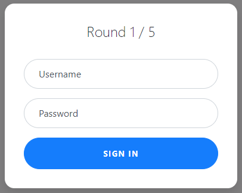
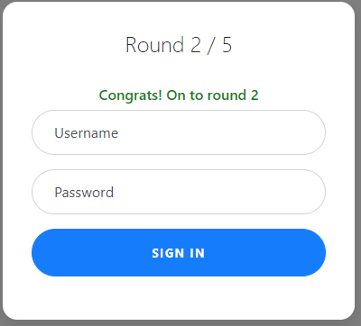
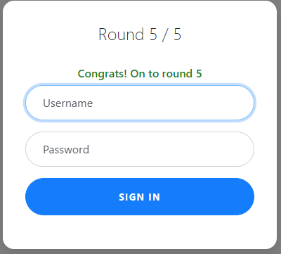
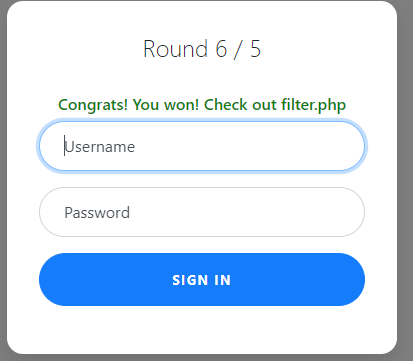

# Web Gauntlet
Author: dch0017

## Challenge Description
Can you beat the filters? Log in as admin

## Accessing Site
This one gives us a login page with rounds 1/5 displayed at top: </br>

</br>

We are also given a ```filter.php``` page which correlates to the round we are on and gives us a filter we cannot use in the username or password field. This list of [operators](https://www.w3schools.blog/operators-sqlite) helps for this challenge.
```
Round1: or
```

## Round 1
I try a default admin/admin approach and it does not work but the query appears at the top of the page.
```sql
SELECT * FROM users WHERE username='admin' AND password='admin'
```
We need to log in as `admin`, so we can leave the username field and just change the password field. Easy enough, let's set it to `a' IS NOT 'b`.</br>

</br>
And we are through to Round 2!

## Round 2
Our filter for round 2 is:
```
Round2: or and like = --
```

Well... let's just use the same answer from round 1?</br>

</br>

## Round 3
Our filter for round 3 is:
```
Round3: or and = like > < --
```

If it ain't broke don't fix it. Let's use `a' IS NOT 'b` for our password and `admin` for username again.

Now it doesn't work. We don't get an error message though. It doesn't look like any of our items are blocked. But if we look at the hex response of the ```filter.php``` page we see that there are additional spaces in the filters, so any whitespace will be filtered out.

What we can do is end the statement after ```admin``` with a semicolon. So our username field would be ```admin';``` and for password we can put anything, like ```test```.</br>

</br>
Off to Round 4.

## Round 4
Filter:
```
Round4: or and = like > < -- admin
```

Same filter as before now we can't use the word admin, but they didn't stop us from using a semicolon. So we just need to use the ``||`` operator to connect it.

```admi'||'n';```</br>

</br>

Final Round

## Round 5
Filters:
```
Round5: or and = like > < -- union admin
```

They only got rid of union, but we weren't using it. So let's go ahead and use the same username from round 4.</br>

</br>


## Flag
On the ```filter.php``` page we are greeted by the PHP code for the filters and at the bottom we see our flag:

```
picoCTF{y0u_m4d3_1t_d846125f7bdbf4d6e89cbc5edb6fa739}
```