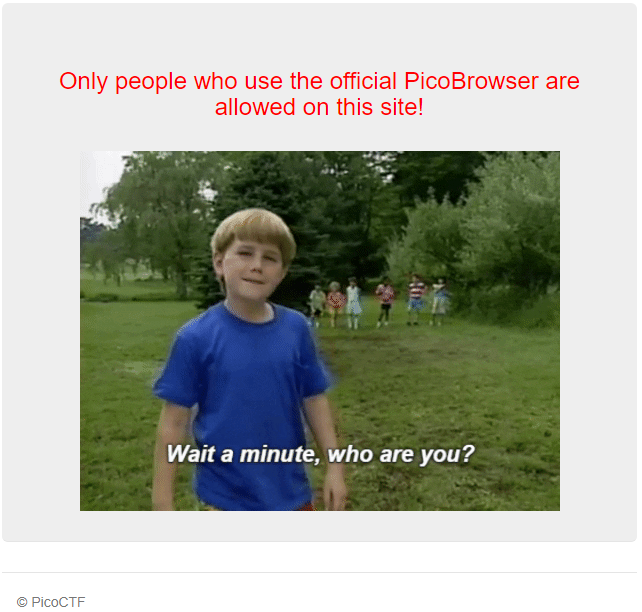
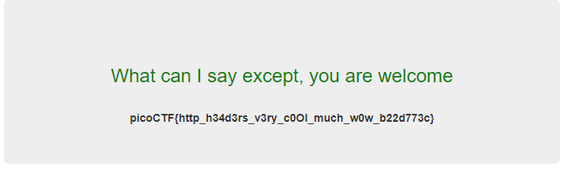

# Who Are You
Author: dch0017

## Challenge Description
Let me in. Let me iiiiiiinnnnnnnnnnnnnnnnnnnn

## Accessing Site
First we head over to site and see this </br>

</br>

No buttons or glaring js files, this one looks like it's going to be request manipulation, lets open burpsuite. Before diving in, a good source of all HTTP Headers can be found here on [Mozilla's Docs](https://developer.mozilla.org/en-US/docs/Web/HTTP/Headers)

## User-Agent
Going off the red text that they only support people who use the official PicoBrowser, we probably should change the ```User-Agent``` header. Lets just change our initial request to include
```
User-Agent: PicoBrowser
```

We get a new message!

## Referer
```
I don't trust users visiting from another site.
```

Looking at HTTP Headers, the ```referer``` one looks like it would fit here. This header lets a server identity referring pages people are visiting from. So let's add that header and reference the current site.
```
Referer: http://mercury.picoctf.net:38322
```

## Date
We get:
```
Sorry, this site only worked in 2018.
```

Let's add a Date header and change it to February 4th, 2018 when the Eagles won their first superbowl. Am I an Eagles fan? No, but gotta respect anyone who beats Tom Brady.

```
Date: Sun, 04 Feb 2018 00:00:00 GMT
```

## DNT
```
I don't trust users who can be tracked.
```
We need to find the header that controls tracking, and we find that with ```DNT``` and according to the docs a value of ```1``` is for users who prefer not to be tracked.

```
DNT: 1
```

## X-Forwarded-For
```
This website is only for people from Sweden.
```

We need to get the site to see us coming from Sweden, with ```X-Forwarded-For``` we can supply a Sweden IP address and it should progress. I pulled an IP from [here](https://lite.ip2location.com/sweden-ip-address-ranges?lang=en_US)

```
X-Forwarded-For: 103.57.72.1
```

## Accept-Language
```
You're in Sweden but you don't speak Swedish?
```
```Accept-Language``` is already included in requests, but ours has been set to English. So let's change that to Swedish ```sv```. Found on [W3's Site](https://www.w3.org/International/ms-lang.html)

```
Accept-Language: sv
```

## Flag!
After all the header changes, we finally have our flag. </br>



## Linux
This could also all have been done using curl instead of burp suite, so here is what that would have looked like.

```console
┌──(dch0017㉿linux)-[~]
└─$ curl http://mercury.picoctf.net:38322/ -H "user-agent:PicoBrowser" -H "Referer:http://mercury.picoctf.net:38322" -H "Date:Sun, 04 Feb 2018 00:00:00 GMT" -H "DNT:1" -H "X-Forwarded-For:103.57.72.1" -H "Accept-Language:sv" --silent | grep
 -o "picoCTF{.*}" --color=none
picoCTF{http_h34d3rs_v3ry_c0Ol_much_w0w_b22d773c}

```

